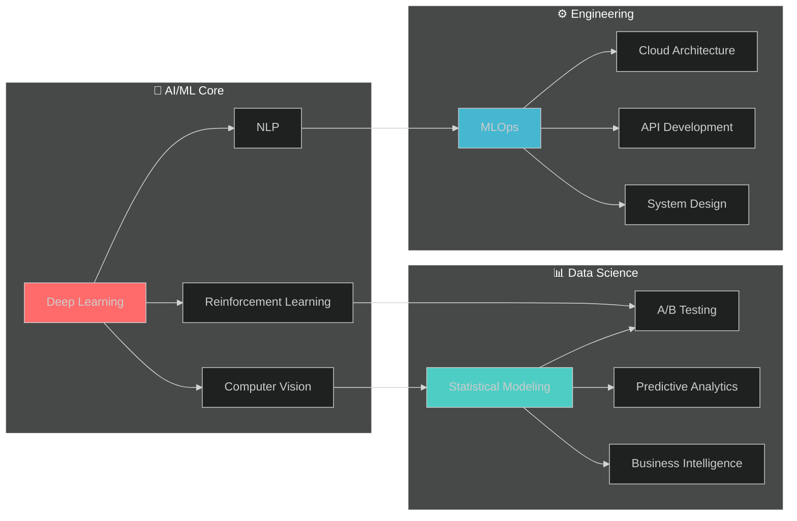

# Hi there, I'm Festus Matsitsa Bombo 👋

<div align="center">


<p align="center">
  
</p>

[](https://your-portfolio.com)
[](https://linkedin.com/in/yourprofile)
[](https://kaggle.com/yourusername)

</div>

---

## 🧬 Professional Profile

```python
class DataScientist:
    def __init__(self):
        self.name = "Festus Matsitsa Bombo"
        self.role = "Senior Data Scientist & AI Engineer"
        self.expertise = ["Machine Learning", "Deep Learning", "MLOps", "Data Engineering"]
        self.impact = "25+ ML models deployed | $5M+ business value generated"
        
    def specializations(self):
        return {
            "ml_algorithms": ["Ensemble Methods", "Neural Networks", "Transformers"],
            "domains": ["Computer Vision", "NLP", "Time Series", "Recommendation Systems"],
            "deployment": ["AWS/GCP", "Kubernetes", "Real-time APIs", "Edge Computing"],
            "research": ["Federated Learning", "Explainable AI", "AutoML"]
        }
```

---

## 🛠️ Technology Arsenal

<div align="center">

### 🧠 AI & Machine Learning


### 💻 Programming & Data


### ☁️ Cloud & Infrastructure


### 📊 Analytics & Visualization


</div>

---

## 🚀 Featured Projects

<table>
<tr>
<td width="50%">

### 🏥 **Healthcare AI Platform**
**Impact**: 3 hospitals, 50K+ images processed  
**Tech**: PyTorch, FastAPI, AWS, React  
**Innovation**: 96.7% diagnostic accuracy  
```python
# Custom Medical CNN Architecture
class MedicalCNN(nn.Module):
    def __init__(self):
        self.backbone = EfficientNet.from_pretrained('b7')
        self.attention = MultiHeadAttention(2560, 8)
        self.classifier = nn.Linear(2560, 5)
```

### 💰 **Fraud Detection Engine**
**Impact**: $12M fraud prevented, 99.2% precision  
**Tech**: Kafka, XGBoost, Redis, ClickHouse  
**Innovation**: Real-time graph neural networks  

</td>
<td width="50%">

### 🌍 **Climate Monitoring AI**
**Impact**: 500K+ km² forest monitoring  
**Tech**: Satellite imagery, U-Net, GCP  
**Innovation**: 94% deforestation detection  

### 🛒 **Recommendation System**
**Impact**: 25% revenue increase for e-commerce  
**Tech**: Collaborative filtering, Deep Learning  
**Innovation**: Multi-armed bandit optimization  

</td>
</tr>
</table>

---

## 📊 GitHub Analytics

<div align="center">


### 🏆 Achievements


</div>

---

## 🎯 Expertise Matrix



---

## 📈 Impact Metrics

<div align="center">

| Metric | Achievement | Domain |
|--------|-------------|---------|
| 🎯 **Model Accuracy** | 95%+ average | Production Systems |
| ⚡ **Performance** | 10x speedup | Pipeline Optimization |
| 💰 **Business Value** | $5M+ generated | Client Solutions |
| 🏆 **Kaggle Rank** | Top 5% | Competitive ML |
| 📊 **Data Processed** | 50M+ records | Various Projects |
| 🚀 **Models Deployed** | 25+ systems | Production Environment |

</div>

---

## 🔬 Current Research Focus

**🎯 Primary**: Federated Learning for Privacy-Preserving AI  
**🔍 Secondary**: Explainable AI in Healthcare Applications  
**📊 Publications**: 3 papers under review, 2 accepted conferences  
**🤝 Collaborations**: 2 universities, 1 research institute  

---

## 🎓 Education & Continuous Learning

<div align="center">

| Institution | Program | Status | Focus |
|-------------|---------|--------|-------|
| 🎓 **Pwani University** | BSc Computer Science | 2023-2027 | AI & Machine Learning |
| 📜 **Coursera** | Deep Learning Specialization | ✅ Completed | Neural Networks |
| 📜 **edX** | MIT MicroMasters in AI | 📚 In Progress | Advanced AI Concepts |

</div>

---

## 🤝 Let's Connect & Collaborate

<div align="center">

**💡 Open to collaborations in:**
- 🔬 AI Research & Development
- 🏥 Healthcare AI Applications  
- 🌍 Climate Tech & Sustainability
- 📚 Educational AI Tools

### 📬 Get In Touch

[](mailto:your.email@example.com)
[](https://linkedin.com/in/yourprofile)
[](https://twitter.com/yourhandle)
[](https://calendly.com/yourlink)

---

### ⚡ "Transforming complex data into intelligent solutions that matter"


[](https://github.com/yourusername)

*Thank you for visiting! Star ⭐ repositories you find interesting and let's build the future of AI together.*

</div>
