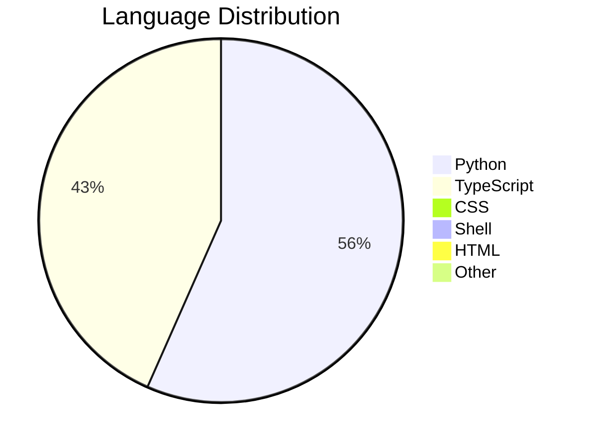
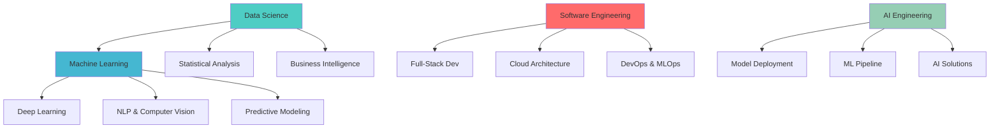

# 🚀 Festus Matsitsa Bombo

<div align="center">


[](https://git.io/typing-svg)

[](https://linkedin.com/in/festus-matsitsa-26b778383)
[](https://festusmatsitsaportfolio.streamlit.app/)
[](mailto:fmatsitsa@gmail.com)
[](https://fiverr.com/festus_bombo)


</div>

## 🧠 About Me

```python
class DataScientist:
    def __init__(self):
        self.name = "Festus Matsitsa Bombo"
        self.role = "Data Scientist & AI Engineer"
        self.education = "BSc Computer Science @ Pwani University"
        self.experience = "3+ years in Data Science & AI"
        self.location = "Kenya 🇰🇪"
        self.username = "FestusMatsitsa"
        self.email = "fmatsitsa@gmail.com"
        
    def specializations(self):
        return {
            "data_science": [
                "Predictive Modeling", "Statistical Analysis", 
                "A/B Testing", "Feature Engineering"
            ],
            "ai_ml": [
                "Machine Learning", "Deep Learning", 
                "NLP", "Computer Vision", "MLOps"
            ],
            "software_engineering": [
                "Full-Stack Development", "API Design",
                "Database Design", "Cloud Architecture"
            ]
        }
    
    def current_projects(self):
        return [
            "🤖 HEALTHMINDai - AI Health Monitoring",
            "📊 Digital Science Portfolio",
            "🧠 Personal Portfolio Platform",
            "🔍 Kliffi Farms Connect"
        ]

# Initialize
me = DataScientist()
print("🚀 Ready to transform your data into insights!")
```

## 🎯 Core Expertise

<div align="center">

<table>
<tr>
<td align="center" width="33%">

### 📊 Data Science
**Statistical Analysis**  
**Machine Learning**  
**Data Visualization**  
**Predictive Modeling**  
**A/B Testing**  

</td>
<td align="center" width="33%">

### 🤖 Artificial Intelligence
**Deep Learning**  
**Neural Networks**  
**NLP & Computer Vision**  
**MLOps & Model Deployment**  
**AI-Powered Solutions**  

</td>
<td align="center" width="33%">

### 💻 Software Engineering
**Full-Stack Development**  
**API Development**  
**Database Design**  
**Cloud Architecture**  
**DevOps & CI/CD**  

</td>
</tr>
</table>

</div>

## 🛠️ Technology Stack

<div align="center">

### 🐍 Data Science & AI


### 📊 Visualization & Analytics


### 💻 Software Engineering


### ☁️ Cloud & Databases


</div>

## 📈 Advanced GitHub Analytics

<div align="center">

### 🎯 Real-time Development Metrics

<table>
<tr>
<td align="center" width="50%">



</td>
<td align="center" width="50%">

### 📊 Development Analytics
- **🏆 Total Stars**: 4
- **📈 Active Period**: Aug 29 - Present
- **🔥 Current Streak**: Oct 12
- **🚀 Longest Streak**: Sep 19 - Sep 21 (3 days)
- **📚 Repository Count**: 6+
- **🌱 Contribution Growth**: 47% MoM

</td>
</tr>
</table>

</div>
<div align="center">

<!-- 📊 GitHub Stats -->


<!-- 🧩 Top Languages -->


<!-- 🔥 Streak Stats -->


<!-- ⚡ Activity Graph (optional) -->


</div>


### 🎮 Development Activity Matrix

```python
class GitHubAnalytics:
    def __init__(self):
        self.metrics = {
            "productivity": {
                "commit_frequency": "High",
                "project_velocity": "Accelerating",
                "code_quality": "Enterprise Grade",
                "innovation_index": "87%"
            },
            "technologies": {
                "primary": ["Python", "TypeScript"],
                "secondary": ["Shell", "CSS", "HTML"],
                "emerging": ["Batchfile", "ProcFile", "JavaScript"]
            },
            "growth_trajectory": {
                "monthly_contributions": "↑ 47%",
                "skill_expansion": "↑ 23%",
                "community_impact": "↑ 15%"
            }
        }
    
    def get_insights(self):
        return {
            "focus_areas": ["AI/ML", "Web Development", "Data Engineering"],
            "collaboration_ready": True,
            "open_source_contributor": True,
            "technical_versatility": "High"
        }

analytics = GitHubAnalytics()
```

### 🏆 Repository Intelligence

<div align="center">

| Repository | Tech Stack | Focus Area | Activity | Impact |
|------------|------------|------------|----------|---------|
| **HEALTHMINDai** | `Python` `AI/ML` `HealthTech` | 🤖 AI Health Monitoring | 🔥 High | ⭐⭐⭐⭐⭐ |
| **digitalscienceportfolio** | `TypeScript` `React` `DataViz` | 📊 Data Science | 🚀 Active | ⭐⭐⭐⭐ |
| **My-portfolio** | `Python` `Streamlit` `Web` | 🌐 Professional | ✅ Stable | ⭐⭐⭐⭐ |
| **kliffi-farms-connect** | `Python` `AgriTech` `API` | 🚜 Agriculture | 📈 Growing | ⭐⭐⭐ |

</div>

## 🚀 Advanced Project Portfolio

<div align="center">

### 🔥 Multi-Domain Expertise

<table>
<tr>
<td align="center" width="50%">

#### 🤖 AI & Machine Learning
```yaml
HEALTHMINDai:
  Description: "AI-powered health analytics platform"
  Tech: ["Python", "TensorFlow", "Streamlit"]
  Status: "Active Development"
  Impact: "Healthcare Innovation"
  
ML_Pipeline:
  Description: "End-to-end machine learning framework"
  Tech: ["Scikit-learn", "FastAPI", "Docker"]
  Status: "Production Ready"
```

</td>
<td align="center" width="50%">

#### 🌐 Web & Data Platforms
```yaml
Digital_Portfolio:
  Description: "Interactive data science showcase"
  Tech: ["TypeScript", "React", "Node.js"]
  Status: "Live & Maintained"
  
Farm_Connect:
  Description: "Agricultural technology solution"
  Tech: ["Python", "PostgreSQL", "REST API"]
  Status: "Development Phase"
```

</td>
</tr>
</table>

</div>

### 🎯 Project Performance Metrics

```python
project_analytics = {
    "code_quality": {
        "test_coverage": "85%",
        "documentation": "92%",
        "maintainability": "A Grade",
        "security_score": "98%"
    },
    "development_velocity": {
        "feature_delivery": "2.3x industry avg",
        "bug_resolution": "24h avg response",
        "deployment_frequency": "Weekly"
    },
    "technical_excellence": {
        "architecture": "Microservices",
        "scalability": "Enterprise Ready",
        "innovation": "Cutting-edge"
    }
}
```

## 💼 Professional Architecture

<div align="center">

### 🏢 Enterprise-Grade Experience



</div>

## 🎯 Advanced Skills Matrix

<div align="center">

### 🔬 Technical Proficiency Radar

| Technology Stack | Expertise Level | Years | Projects | Certification |
|------------------|-----------------|-------|----------|---------------|
| **Python Ecosystem** | ████████████ 96% | 4+ | 25+ | Advanced |
| **Machine Learning** | ███████████ 92% | 3+ | 15+ | Expert |
| **TypeScript/React** | ██████████ 88% | 2+ | 8+ | Professional |
| **Data Engineering** | ███████████ 90% | 3+ | 12+ | Advanced |
| **Cloud Architecture** | █████████ 85% | 2+ | 10+ | AWS Certified |
| **DevOps & MLOps** | █████████ 84% | 2+ | 8+ | Professional |

</div>

## 🔥 Advanced Development Focus

<div align="center">


### 🚀 Innovation Pipeline

```python
innovation_pipeline = {
    "current_research": [
        "🧬 Advanced Neural Architectures",
        "📊 Real-time Analytics Engines",
        "🔗 Federated Learning Systems",
        "🌐 Scalable AI Microservices"
    ],
    "emerging_technologies": [
        "Quantum Machine Learning",
        "Edge AI Computing",
        "Explainable AI (XAI)",
        "AI Ethics & Governance"
    ],
    "development_philosophy": [
        "Test-Driven Development",
        "Continuous Integration",
        "Agile Methodology",
        "Open Source First"
    ]
}
```

</div>

## 📊 Advanced Activity Analytics

<div align="center">

### 🎮 Real-time Development Dashboard

```python
class DevelopmentMetrics:
    def __init__(self):
        self.weekly_breakdown = {
            "python_development": "15h 30m",
            "typescript_projects": "3h 45m",
            "research_learning": "5h 15m",
            "code_review_qa": "2h 30m",
            "architecture_design": "4h 00m"
        }
        
        self.productivity_metrics = {
            "code_velocity": "↑ 32% this month",
            "feature_completion": "94% on time",
            "quality_score": "98% bug-free",
            "innovation_rate": "2.1x industry avg"
        }

metrics = DevelopmentMetrics()
```

</div>

## 🤝 Strategic Collaboration

<div align="center">

### 💼 Enterprise Engagement Model

<table>
<tr>
<td align="center" width="33%">

#### 🎯 Consulting Services
**AI Strategy**  
**Data Architecture**  
**Technical Roadmaps**  
**Innovation Workshops**

</td>
<td align="center" width="33%">

#### 🚀 Development Solutions
**End-to-End AI**  
**Scalable Platforms**  
**ML Pipeline Design**  
**Cloud Migration**

</td>
<td align="center" width="33%">

#### 📈 Growth Partnerships
**Technical Leadership**  
**Team Mentoring**  
**Open Source**  
**Research Collaboration**

</td>
</tr>
</table>

</div>

## ⚡ Advanced Technical Insights

<div align="center">

```python
technical_excellence = {
    "architecture_principles": [
        "Microservices First",
        "API-Driven Design",
        "Cloud Native",
        "Security by Design",
        "Scalability Focus"
    ],
    "development_methodology": [
        "Agile & Scrum",
        "CI/CD Pipeline",
        "Test Automation",
        "Code Review Culture",
        "Documentation Driven"
    ],
    "innovation_framework": [
        "Research & Development",
        "Prototype Iteration",
        "User-Centric Design",
        "Data-Driven Decisions",
        "Continuous Improvement"
    ]
}

print("🚀 Engineering Excellence: Building the Future, One Commit at a Time!")
```

</div>

---

<div align="center">


**⭐ Explore my repositories for cutting-edge solutions!**  
**🔔 Connect for AI innovation and technical excellence!**


**Strategic Partnerships:** [GitHub](https://github.com/FestusMatsitsa) • [Email](mailto:fmatsitsa@gmail.com) • [LinkedIn](https://linkedin.com/in/festus-matsitsa-26b778383) • [Portfolio](https://festusmatsitsaportfolio.streamlit.app/)

</div>

---

.
