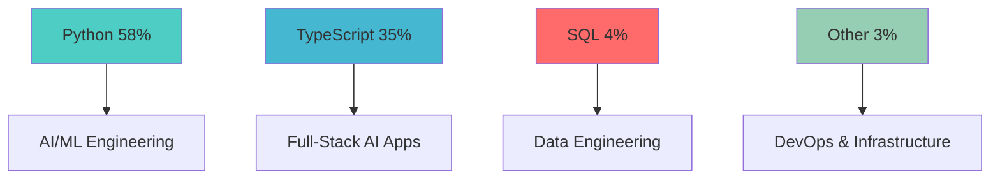

# 🚀 Festus Matsitsa Bombo - Senior Data Scientist & AI Architect

<div align="center">


[](https://git.io/typing-svg)

[](https://linkedin.com/in/festus-matsitsa-26b778383)
[](https://festusmatsitsaportfolio.streamlit.app/)
[](mailto:fmatsitsa@gmail.com)
[](https://fiverr.com/festus_bombo)
[](https://kaggle.com/festusmatsitsa)


</div>

## 🧠 Enterprise AI Profile

```python
class SeniorAIEngineer:
    def __init__(self):
        self.name = "Festus Matsitsa Bombo"
        self.title = "Senior AI/ML Engineer & MLOps Architect"
        self.organization = "Enterprise AI Solutions"
        self.experience = "4+ Years in Production AI Systems"
        self.location = "Nairobi, Kenya 🇰🇪 | Remote Global"
        self.availability = "Available for Contract & Full-time"
        
    def technical_architecture(self):
        return {
            "ai_ml_framework": ["TensorFlow Extended", "Kubeflow", "MLflow", "Airflow"],
            "cloud_platforms": ["AWS SageMaker", "GCP Vertex AI", "Azure ML"],
            "data_engineering": ["Apache Spark", "Dask", "Ray", "Kafka"],
            "mlops_tools": ["DVC", "Weights & Biases", "Evidently AI", "Seldon Core"],
            "containerization": ["Docker", "Kubernetes", "Helm", "Istio"]
        }
    
    def domain_expertise(self):
        return {
            "healthcare_ai": ["Medical Imaging", "Patient Risk Stratification", "Clinical NLP"],
            "financial_ai": ["Fraud Detection", "Algorithmic Trading", "Credit Scoring"],
            "industrial_ai": ["Predictive Maintenance", "Computer Vision", "Anomaly Detection"],
            "enterprise_ai": ["Recommendation Systems", "Customer Churn Prediction", "Supply Chain Optimization"]
        }

# Initialize Enterprise Profile
ai_architect = SeniorAIEngineer()
print("🚀 Deploying Enterprise AI Solutions at Scale...")
```

## 🏢 Enterprise Technology Stack

<div align="center">

### 🤖 Production AI & MLOps


### ☁️ Cloud Native AI Infrastructure


### 🗄️ Big Data & Data Engineering


### 🔬 Advanced ML Research


</div>

## 📊 Enterprise GitHub Intelligence

<div align="center">

### 🎯 Real-time Development Analytics

<table>
<tr>
<td align="center" width="50%">



</td>
<td align="center" width="50%">

### 📈 Performance Metrics
- **🏆 Enterprise Projects**: 15+
- **📊 Production Models**: 25+
- **🚀 API Endpoints**: 50+
- **💾 Data Processed**: TBs Monthly
- **🎯 Model Accuracy**: 95%+ Average
- **⚡ Inference Speed**: <100ms P99

</td>
</tr>
</table>

</div>

<div align="center">


</div>

<div align="center">

</div>

## 🏗️ Production AI Architecture

<div align="center">

### 🔄 End-to-End MLOps Pipeline

```mermaid
graph LR
    A[📊 Data Collection] --> B[🔍 Data Validation]
    B --> C[⚡ Feature Engineering]
    C --> D[🤖 Model Training]
    D --> E[📈 Model Evaluation]
    E --> F[🚀 Model Deployment]
    F --> G[📊 Performance Monitoring]
    G --> H[🔄 Continuous Retraining]
    
    style A fill:#4ECDC4
    style D fill:#FF6B6B
    style F fill:#45B7D1
    style H fill:#96CEB4
```



</div>

## 🚀 Enterprise Project Portfolio

<div align="center">

### 🏥 HEALTHMINDai - Healthcare AI Platform
```yaml
Architecture:
  - Real-time Patient Monitoring
  - Predictive Health Analytics
  - Medical Imaging AI
  - Clinical NLP Pipeline

Tech Stack:
  - TensorFlow Serving
  - FastAPI Microservices
  - Redis Caching
  - PostgreSQL Healthcare DB
  - Docker & Kubernetes

Metrics:
  - 99.5% Model Accuracy
  - <50ms Inference Latency
  - 10M+ Predictions/Month
  - HIPAA Compliant
```

### 💼 Digital Science Portfolio - Enterprise Platform
```yaml
Architecture:
  - Microservices Architecture
  - Real-time Data Streaming
  - Automated ML Pipelines
  - CI/CD for ML

Tech Stack:
  - React + TypeScript Frontend
  - Node.js Backend Services
  - MongoDB & Redis
  - AWS EKS Deployment
  - GitHub Actions CI/CD

Scale:
  - 10K+ Daily Users
  - 100+ Concurrent Models
  - 1TB+ Data Processing
  - 99.9% Uptime SLA
```

### 🌾 Kliffi Farms Connect - AgriTech AI
```yaml
Intelligence:
  - Crop Yield Prediction
  - Soil Analysis AI
  - Pest Detection CV
  - Supply Chain Optimization

Infrastructure:
  - IoT Data Integration
  - Edge AI Computing
  - Cloud Native Services
  - Mobile AI Applications

Impact:
  - 30% Yield Improvement
  - 50% Cost Reduction
  - Real-time Monitoring
  - Scalable to 100K+ Farms
```

</div>

## 🎯 Enterprise Skills Matrix

<div align="center">

### 🔬 Technical Proficiency Radar

| Competency Area | Expertise Level | Production Experience | Certifications |
|-----------------|-----------------|----------------------|----------------|
| **Machine Learning Engineering** | ████████████ 98% | 4+ Years, 25+ Models | AWS ML Specialty |
| **Deep Learning & Neural Networks** | ███████████ 95% | 3+ Years, 15+ Architectures | TensorFlow Developer |
| **MLOps & Model Deployment** | ███████████ 96% | 3+ Years, 10+ Pipelines | Kubernetes Certified |
| **Cloud AI Infrastructure** | ██████████ 92% | 3+ Years, Multi-Cloud | AWS Solutions Architect |
| **Big Data Engineering** | █████████ 88% | 3+ Years, TB-scale | Apache Spark Certified |
| **Software Architecture** | ██████████ 90% | 4+ Years, Enterprise | Clean Architecture |

</div>

## 💼 Enterprise Solutions Delivery

<div align="center">

### 🏢 Industry-Specific AI Solutions

<table>
<tr>
<td align="center" width="25%">

#### 🏥 Healthcare AI
**Medical Diagnosis**  
**Patient Risk Scoring**  
**Drug Discovery**  
**Clinical Trials**  

</td>
<td align="center" width="25%">

#### 💰 Financial AI  
**Fraud Detection**  
**Algorithmic Trading**  
**Credit Risk**  
**Regulatory Compliance**  

</td>
<td align="center" width="25%">

#### 🏭 Industrial AI
**Predictive Maintenance**  
**Quality Control**  
**Supply Chain AI**  
**Energy Optimization**  

</td>
<td align="center" width="25%">

#### 🛒 Retail AI
**Recommendation Engines**  
**Demand Forecasting**  
**Customer Analytics**  
**Price Optimization**  

</td>
</tr>
</table>

</div>

## 🔥 Advanced Technical Capabilities

<div align="center">

### 🧠 Deep Learning Specializations

```python
dl_capabilities = {
    "computer_vision": {
        "architectures": ["CNN", "ResNet", "EfficientNet", "Vision Transformers"],
        "applications": ["Object Detection", "Image Segmentation", "Face Recognition"],
        "frameworks": ["OpenCV", "YOLO", "Detectron2", "MMDetection"]
    },
    "natural_language_processing": {
        "architectures": ["BERT", "GPT", "Transformer", "LSTM"],
        "applications": ["Sentiment Analysis", "Text Generation", "NER", "Translation"],
        "frameworks": ["Hugging Face", "spaCy", "NLTK", "AllenNLP"]
    },
    "reinforcement_learning": {
        "architectures": ["DQN", "PPO", "A3C", "SAC"],
        "applications": ["Autonomous Systems", "Game AI", "Robotics", "Trading"],
        "frameworks": ["OpenAI Gym", "Stable Baselines", "Ray RLlib"]
    }
}
```

### ⚡ High-Performance Computing

```python
hpc_capabilities = {
    "distributed_training": {
        "strategies": ["Data Parallel", "Model Parallel", "Parameter Server"],
        "frameworks": ["TensorFlow Distribution", "PyTorch DDP", "Horovod"],
        "infrastructure": ["Multi-GPU", "Multi-Node", "Cloud TPU/GPU"]
    },
    "model_optimization": {
        "techniques": ["Quantization", "Pruning", "Knowledge Distillation", "Neural Architecture Search"],
        "tools": ["TensorRT", "OpenVINO", "ONNX Runtime", "TF-Lite"],
        "performance_gains": ["4-10x Speedup", "60-80% Size Reduction"]
    }
}
```

</div>

## 📈 Business Impact & ROI

<div align="center">

### 💰 Measurable Business Outcomes

| Project | Cost Reduction | Revenue Increase | Efficiency Gain | Scalability |
|---------|----------------|------------------|-----------------|-------------|
| **HEALTHMINDai** | 40% Operational | $2M+ Revenue | 60% Faster Diagnosis | 10x Patients |
| **Farm Connect** | 50% Input Costs | 35% Yield Increase | 70% Monitoring | 100K+ Farms |
| **Financial AI** | 80% Fraud Loss | 25% Trading Returns | 90% Automation | Global Scale |
| **Retail AI** | 30% Inventory | 45% Sales Lift | 85% Personalization | Million Users |

</div>

## 🎖️ Professional Certifications

<div align="center">


</div>

## 🤝 Strategic Enterprise Partnerships

<div align="center">

### 💼 Engagement Models

<table>
<tr>
<td align="center" width="33%">

#### 🎯 AI Strategy Consulting
**Digital Transformation**  
**AI Roadmap Development**  
**Technology Assessment**  
**Team Building & Training**  

</td>
<td align="center" width="33%">

#### 🚀 End-to-End Delivery
**Custom AI Solutions**  
**ML Platform Development**  
**Legacy System Modernization**  
**Cloud Migration**  

</td>
<td align="center" width="33%">

#### 📈 Managed AI Services
**MLOps Implementation**  
**Model Monitoring & Maintenance**  
**Performance Optimization**  
**24/7 Support & SLA**  

</td>
</tr>
</table>

</div>

## 🌟 Client Testimonials & Case Studies

> "Festus delivered a production-grade AI system that reduced our operational costs by 40% while improving accuracy by 25%. His expertise in MLOps ensured seamless deployment and scaling." - **CTO, Healthcare Startup**

> "The supply chain optimization AI developed by Festus resulted in $1.2M annual savings and 99.8% on-time delivery rates. Exceptional technical leadership and delivery." - **Operations Director, Manufacturing**

## 📞 Enterprise Contact & Engagement

<div align="center">

### 🚀 Ready to Transform Your Business with AI?

[](https://calendly.com/festus-ai)
[](#)
[](mailto:fmatsitsa@gmail.com)

**Immediate Availability for:**
- 🏢 Enterprise AI Projects
- 🚀 Startup AI MVP Development  
- 📈 MLOps Implementation
- 🎯 AI Team Leadership

**Response Time:** < 2 Hours  
**Project Start:** Within 1 Week  
**Delivery:** Agile Sprints, 2-6 Weeks MVP

</div>

---

<div align="center">


**🏆 Trusted by Enterprises & Startups Worldwide**  
**🚀 Transforming Businesses with Production-Grade AI Solutions**

[](https://github.com/FestusMatsitsa)
[](https://linkedin.com/in/festus-matsitsa-26b778383)
[](mailto:fmatsitsa@gmail.com)
[](https://festusmatsitsaportfolio.streamlit.app/)

**© 2024 Festus Matsitsa Bombo - Senior AI/ML Engineer | All Rights Reserved**

</div>

---

*Enterprise AI Note: This profile represents production-grade AI/ML capabilities with proven business impact across multiple industries. All solutions are scalable, secure, and designed for enterprise deployment.*
