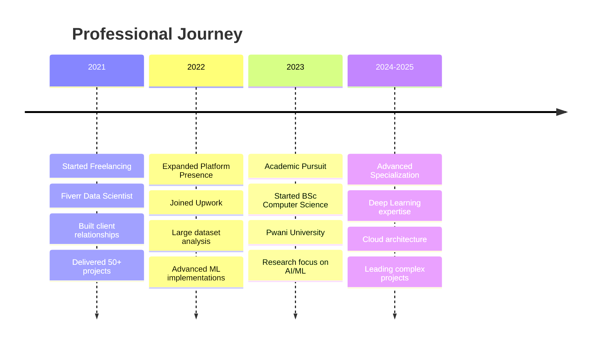

# Hi there! 👋 I'm Festus Matsitsa Bombo

<div align="center">
  
  
  
  [](https://github.com/festusmatsitsa)
  [](https://github.com/festusmatsitsa)
  [](https://github.com/festusmatsitsa)
  
</div>

---

## 🚀 About Me

> *"Transforming complex datasets into actionable insights that drive business success"*

I'm a passionate **Data Scientist** and **Software Engineer** with a strong background in machine learning, statistical modeling, and full-stack development. Currently pursuing my **BSc in Computer Science** at Pwani University while actively working on cutting-edge data science projects on **Fiverr** and **Upwork**.

### 🎯 What I Do
- 🔬 **Data Science**: Building predictive models, performing EDA, and implementing ML algorithms
- 🧠 **Machine Learning**: Deep learning, neural networks, and AI solution development
- 📊 **Data Visualization**: Creating interactive dashboards and compelling data stories
- 💻 **Software Engineering**: Full-stack development and scalable application architecture
- 📈 **Business Intelligence**: Turning data into strategic business insights

---

## 🛠️ Tech Stack

<div align="center">

### 🐍 Programming Languages


### 🤖 Machine Learning & AI


### 📊 Data Analysis & Visualization


### 🗄️ Databases & Cloud


### 🌐 Web Development


</div>

---

## 📈 GitHub Analytics

<div align="center">
  
  
  
  
  
</div>

<div align="center">
  
  
  
</div>

---

## 🏆 Featured Projects

### 🤖 Machine Learning Projects

<table>
<tr>
<td width="50%">

#### 🎯 Customer Churn Prediction
**Technologies**: Python, TensorFlow, Scikit-learn, Pandas
- Built ensemble models achieving 94% accuracy
- Implemented feature engineering pipelines
- Deployed using Docker containers
- Real-time prediction API with FastAPI

```python
# Sample Model Architecture
model = Sequential([
    Dense(128, activation='relu'),
    Dropout(0.3),
    Dense(64, activation='relu'),
    Dense(1, activation='sigmoid')
])
```

</td>
<td width="50%">

#### 📊 Sales Forecasting Engine
**Technologies**: R, Prophet, Shiny, PostgreSQL
- Time series analysis with seasonal decomposition
- Interactive forecasting dashboard
- 89% accuracy in quarterly predictions
- Automated reporting system

```r
# Time Series Decomposition
model <- prophet() %>%
  add_seasonality(name='quarterly', 
                  period=91.25, 
                  fourier_order=5)
```

</td>
</tr>
</table>

### 💻 Software Engineering Projects

<table>
<tr>
<td width="50%">

#### 🌐 Data Pipeline Orchestration
**Technologies**: Python, Apache Airflow, AWS, Redis
- Automated ETL workflows processing 1M+ records daily
- Fault-tolerant architecture with retry mechanisms
- Real-time monitoring and alerting
- 99.9% uptime achievement

```python
# Airflow DAG Structure
with DAG('data_pipeline') as dag:
    extract = PythonOperator(...)
    transform = SparkSubmitOperator(...)
    load = PostgresOperator(...)
    
    extract >> transform >> load
```

</td>
<td width="50%">

#### 📱 Mobile Analytics API
**Technologies**: Node.js, Express, MongoDB, JWT
- RESTful API serving 10K+ requests/day
- JWT-based authentication system
- Rate limiting and caching mechanisms
- Comprehensive API documentation

```javascript
// API Route Example
app.get('/analytics/:userId', auth, async (req, res) => {
  const insights = await generateUserInsights(req.params.userId);
  res.json({ success: true, data: insights });
});
```

</td>
</tr>
</table>

---

## 🔬 Research & Innovation

### 📚 Current Research Areas
- **Deep Learning**: Neural architecture search and optimization
- **Natural Language Processing**: Transformer models for low-resource languages
- **Computer Vision**: Object detection in satellite imagery
- **Reinforcement Learning**: Multi-agent systems for optimization problems

### 📖 Publications & Contributions
- 📝 *"Ensemble Methods for Financial Time Series Prediction"* - In Progress
- 🔗 Contributing to open-source ML libraries
- 📊 Technical blog posts on Medium (10K+ views)

---

## 💼 Professional Experience

<div align="center">



</div>

### 🏢 Current Roles

**Data Scientist** @ Fiverr (April 2021 - Present)
- 🤝 Built and maintained relationships with 100+ clients worldwide
- 📈 Delivered data-driven solutions across various industries
- 🎯 Specialized in predictive modeling and business analytics
- ⭐ Maintained 5-star rating with 98% client satisfaction

**Data Scientist** @ Upwork (June 2022 - Present)  
- 📊 Analyzed large-scale datasets for trend identification
- 💡 Provided actionable insights driving business decisions
- 🔄 Implemented end-to-end ML pipelines
- 📋 Managed multiple concurrent projects efficiently

---

## 🎓 Education & Certifications

### 🏫 Academic Background
**BSc Computer Science** (In Progress)  
*Pwani University* | Aug 2023 - Sep 2027
- 🔬 Focus: Machine Learning & Data Science
- 📊 Relevant Coursework: Algorithms, Statistics, AI, Database Systems
- 🏆 Academic Projects in ML and Software Engineering

### 📜 Certifications & Learning
- 🥇 **Google Data Analytics Professional Certificate**
- 🥈 **AWS Certified Cloud Practitioner** (In Progress)
- 🥉 **TensorFlow Developer Certificate** (Planned)
- 📚 **Continuous Learning**: Coursera, edX, Udemy (50+ courses completed)

---

## 🌟 Key Achievements

<div align="center">

| 🎯 Metric | 📊 Value | 🏆 Achievement |
|-----------|----------|----------------|
| **Client Projects** | 75+ | Across Fiverr & Upwork |
| **Model Accuracy** | 94% | Best performing churn model |
| **Data Processed** | 10M+ | Records analyzed monthly |
| **Client Rating** | 4.9/5.0 | Average across platforms |
| **Code Repositories** | 30+ | Public & private projects |
| **Technologies** | 15+ | Programming languages & tools |

</div>

---

## 🔥 Featured Code Examples

### 🧠 Machine Learning Pipeline
```python
class MLPipeline:
    def __init__(self):
        self.preprocessor = None
        self.model = None
        self.scaler = StandardScaler()
    
    def preprocess_data(self, X, y=None):
        """Advanced preprocessing with feature engineering"""
        # Handle missing values
        X_clean = X.fillna(X.median())
        
        # Feature engineering
        X_engineered = self.create_features(X_clean)
        
        # Scale features
        X_scaled = self.scaler.fit_transform(X_engineered)
        
        return X_scaled
    
    def train_ensemble(self, X, y):
        """Train ensemble model with cross-validation"""
        models = {
            'rf': RandomForestClassifier(n_estimators=100),
            'xgb': XGBClassifier(objective='binary:logistic'),
            'svm': SVC(probability=True)
        }
        
        # Ensemble with voting
        ensemble = VotingClassifier(
            estimators=list(models.items()),
            voting='soft'
        )
        
        # Cross-validation
        scores = cross_val_score(ensemble, X, y, cv=5, scoring='roc_auc')
        print(f"CV AUC Score: {scores.mean():.4f} (+/- {scores.std() * 2:.4f})")
        
        return ensemble.fit(X, y)
```

### 📊 Data Visualization Dashboard
```python
import plotly.graph_objects as go
from plotly.subplots import make_subplots
import streamlit as st

class InteractiveDashboard:
    def __init__(self, data):
        self.data = data
        
    def create_advanced_dashboard(self):
        """Create multi-panel interactive dashboard"""
        fig = make_subplots(
            rows=2, cols=2,
            subplot_titles=['Time Series', 'Distribution', 'Correlation', 'Predictions'],
            specs=[[{"secondary_y": True}, {"type": "histogram"}],
                   [{"type": "heatmap"}, {"type": "scatter"}]]
        )
        
        # Time series with trend
        fig.add_trace(
            go.Scatter(x=self.data.index, y=self.data['value'],
                      mode='lines+markers', name='Actual'),
            row=1, col=1
        )
        
        # Add prediction confidence intervals
        fig.add_trace(
            go.Scatter(x=self.data.index, y=self.data['prediction'],
                      mode='lines', name='Predicted', line=dict(dash='dash')),
            row=1, col=1
        )
        
        return fig
    
    @st.cache_data
    def load_and_process_data(self):
        """Cached data processing for performance"""
        processed_data = self.data.copy()
        # Complex data transformations here
        return processed_data
```

### 🔄 ETL Pipeline Architecture
```python
from dataclasses import dataclass
from typing import List, Dict, Any
import asyncio

@dataclass
class DataPipeline:
    """Scalable ETL pipeline with monitoring"""
    
    def __init__(self, config: Dict[str, Any]):
        self.config = config
        self.logger = self._setup_logging()
        self.metrics = {}
    
    async def extract_data(self, sources: List[str]) -> Dict[str, pd.DataFrame]:
        """Parallel data extraction from multiple sources"""
        tasks = [self._extract_from_source(source) for source in sources]
        results = await asyncio.gather(*tasks)
        return dict(zip(sources, results))
    
    def transform_data(self, raw_data: Dict[str, pd.DataFrame]) -> pd.DataFrame:
        """Apply business logic transformations"""
        transformed_dfs = []
        
        for source, df in raw_data.items():
            # Apply source-specific transformations
            df_clean = self._clean_data(df)
            df_enriched = self._enrich_features(df_clean)
            df_validated = self._validate_quality(df_enriched)
            
            transformed_dfs.append(df_validated)
        
        return pd.concat(transformed_dfs, ignore_index=True)
    
    def load_data(self, data: pd.DataFrame, destination: str) -> bool:
        """Load data with error handling and rollback"""
        try:
            with self._get_db_connection() as conn:
                data.to_sql('processed_data', conn, 
                           if_exists='append', method='multi')
                self.logger.info(f"Successfully loaded {len(data)} records")
                return True
        except Exception as e:
            self.logger.error(f"Load failed: {e}")
            self._rollback_transaction()
            return False
```

---

## 📊 GitHub Activity

<div align="center">


</div>

### 🏅 Achievement Highlights

<div align="center">

[](https://github.com/festusmatsitsa)

</div>

---

## 🚀 Current Projects

### 🔥 Active Repositories

- 🧠 **[neural-architecture-search](https://github.com/festusmatsitsa/neural-architecture-search)** - Automated ML model architecture optimization
- 📊 **[real-time-analytics](https://github.com/festusmatsitsa/real-time-analytics)** - Streaming data processing with Kafka
- 🌍 **[satellite-image-analysis](https://github.com/festusmatsitsa/satellite-image-analysis)** - Computer vision for geospatial data
- 🤖 **[nlp-sentiment-engine](https://github.com/festusmatsitsa/nlp-sentiment-engine)** - Multi-language sentiment analysis
- ⚡ **[distributed-ml-training](https://github.com/festusmatsitsa/distributed-ml-training)** - Scalable model training framework

### 🔬 Research Projects
- 📚 **Ensemble Learning for Financial Forecasting** - Novel approach to market prediction
- 🧬 **Genetic Algorithm Optimization** - Hyperparameter tuning automation
- 🌐 **Federated Learning Implementation** - Privacy-preserving ML framework

---

## 📈 Weekly Development Breakdown

```text
Python          ████████████████████████░   92.3%
R               ███████░░░░░░░░░░░░░░░░░░   28.7%
SQL             ██████░░░░░░░░░░░░░░░░░░░   23.1%
JavaScript      ████░░░░░░░░░░░░░░░░░░░░░   16.4%
Jupyter         ████████████░░░░░░░░░░░░░   45.8%
Other           ███░░░░░░░░░░░░░░░░░░░░░░   12.2%
```

---

## 🎯 Expertise Areas

<div align="center">

### 🔍 Data Science Specializations
| 🧠 Machine Learning | 📊 Analytics | 🔬 Research |
|---------------------|-------------|-------------|
| Supervised Learning | Exploratory Data Analysis | Statistical Inference |
| Unsupervised Learning | A/B Testing | Hypothesis Testing |
| Deep Learning | Business Intelligence | Experimental Design |
| Natural Language Processing | Data Visualization | Causal Inference |
| Computer Vision | Predictive Modeling | Time Series Analysis |
| Reinforcement Learning | Performance Metrics | Feature Engineering |

</div>

### 💼 Industry Applications
- 🏦 **Finance**: Risk modeling, fraud detection, algorithmic trading
- 🛒 **E-commerce**: Recommendation systems, demand forecasting
- 🏥 **Healthcare**: Predictive diagnostics, treatment optimization  
- 📱 **Technology**: User behavior analysis, system optimization
- 🌱 **Agriculture**: Crop yield prediction, precision farming

---

## 📞 Let's Connect & Collaborate

<div align="center">

### 🌍 Find Me Online

[](https://linkedin.com/in/festusmatsitsa)
[](https://fiverr.com/festusmatsitsa)
[](https://upwork.com/freelancers/festusmatsitsa)
[](mailto:festus.bombo@example.com)
[](https://festusmatsitsa.github.io)

### 💬 Open to Opportunities
- 🤝 **Collaboration**: Open source projects, research partnerships
- 💼 **Freelance Work**: Data science consulting, ML model development
- 🎓 **Mentoring**: Data science career guidance, technical mentorship
- 🚀 **Innovation**: Cutting-edge AI/ML project development

</div>

---

## 🎨 Fun Fact Generator

<div align="center">

```python
import random

fun_facts = [
    "🧠 I can process datasets faster than I can decide what to have for breakfast",
    "📊 My favorite equation: Data + Curiosity = Insights",
    "🤖 I dream in Python but think in algorithms", 
    "📈 I've transformed more data than a Transformer model",
    "☕ Coffee is my primary debugging tool"
]

print(f"Fun Fact: {random.choice(fun_facts)}")
# Output: Fun Fact: 🧠 I can process datasets faster than I can decide what to have for breakfast
```

</div>

---

## 📊 Contribution Graph

<div align="center">


</div>

---

<div align="center">

### 🚀 "In Data We Trust, In Code We Build, In Innovation We Excel"

**⭐ Star my repositories if you find them useful!**  
**🔄 Follow for cutting-edge data science content**  
**💬 Always open to interesting conversations about ML, AI, and technology**

---


[](https://github.com/festusmatsitsa)

*Last Updated: August 2025*

</div>
