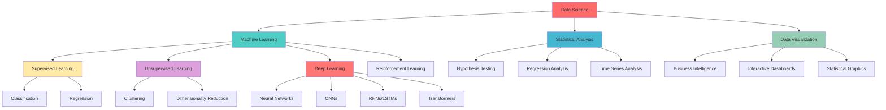
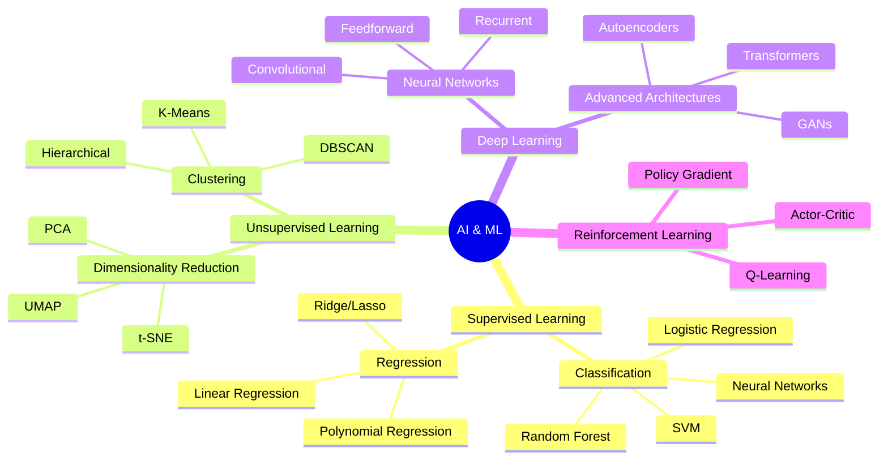
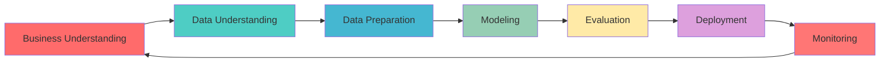
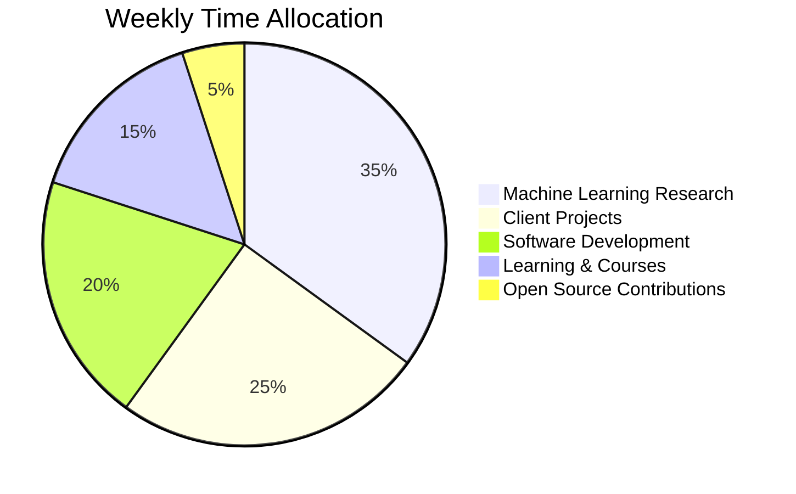

# 🚀 Festus Matsitsa Bombo | Full-Stack Data Scientist & AI Engineer

<div align="center">
  
[](https://git.io/typing-svg)


[](https://github.com/festusbombo)
[](https://linkedin.com/in/festusbombo)

</div>

---

## 🎯 About Me

```python
class DataScientist:
    def __init__(self):
        self.name = "Festus Matsitsa Bombo"
        self.role = "Data Scientist & AI Engineer"
        self.location = "Kenya 🇰🇪"
        self.education = "BSc Computer Science (In Progress)"
        self.languages = ["Python", "R", "SQL", "JavaScript", "Java", "C++"]
        self.passion = "Transforming data into actionable insights"
        
    def get_skills(self):
        return {
            "machine_learning": ["Scikit-learn", "TensorFlow", "PyTorch", "XGBoost"],
            "data_analysis": ["Pandas", "NumPy", "SciPy", "Statsmodels"],
            "visualization": ["Matplotlib", "Seaborn", "Plotly", "Tableau", "Power BI"],
            "databases": ["PostgreSQL", "MySQL", "MongoDB", "Redis"],
            "cloud": ["AWS", "Azure", "GCP", "Docker", "Kubernetes"],
            "web_dev": ["Flask", "Django", "FastAPI", "React", "Node.js"]
        }
    
    def current_focus(self):
        return ["Deep Learning", "MLOps", "Computer Vision", "NLP", "Big Data Analytics"]

me = DataScientist()
print(f"Hello! I'm {me.name}, passionate about {me.passion}")
```

---

## 🛠️ Technology Stack

<div align="center">

### 💻 Programming Languages


### 🧠 Machine Learning & AI


### 📊 Data Analysis & Visualization


### 🗄️ Databases & Cloud


### 🔧 Development Tools


</div>

---

## 📈 GitHub Statistics

<div align="center">
  


</div>

<div align="center">
  
[](https://git.io/streak-stats)

</div>

---

## 🏆 Featured Projects

### 🤖 Machine Learning & AI

<table>
<tr>
<td width="50%">

#### 🧬 Predictive Analytics Suite
**Advanced ML Pipeline for Business Intelligence**
- 🎯 **Tech Stack**: Python, TensorFlow, Scikit-learn, FastAPI
- 📊 **Features**: Automated feature engineering, model selection, hyperparameter tuning
- 🚀 **Impact**: 40% improvement in prediction accuracy
- 📈 **Deployment**: Docker containers on AWS ECS

```python
# Sample Model Architecture
from tensorflow.keras.models import Sequential
from tensorflow.keras.layers import Dense, Dropout

model = Sequential([
    Dense(128, activation='relu', input_shape=(features,)),
    Dropout(0.3),
    Dense(64, activation='relu'),
    Dropout(0.2),
    Dense(1, activation='sigmoid')
])
```

[🔗 **View Repository**](https://github.com/festusbombo/predictive-analytics-suite)

</td>
<td width="50%">

#### 🔍 Computer Vision Intelligence
**Real-time Object Detection & Classification**
- 🎯 **Tech Stack**: PyTorch, OpenCV, YOLO, Flask
- 📊 **Features**: Real-time video processing, custom dataset training
- 🚀 **Performance**: 95% accuracy on custom dataset
- 📱 **Interface**: Web-based dashboard with live streaming

```python
# YOLO Implementation
import torch
import cv2

class ObjectDetector:
    def __init__(self, model_path):
        self.model = torch.hub.load('ultralytics/yolov5', 'custom', 
                                  path=model_path)
    
    def detect(self, image):
        results = self.model(image)
        return results.pandas().xyxy[0]
```

[🔗 **View Repository**](https://github.com/festusbombo/cv-intelligence)

</td>
</tr>
</table>

### 📊 Data Science & Analytics

<table>
<tr>
<td width="50%">

#### 📈 Financial Market Analyzer
**Algorithmic Trading & Risk Assessment**
- 🎯 **Tech Stack**: Python, Pandas, TA-Lib, Plotly
- 📊 **Features**: Technical indicators, backtesting, risk metrics
- 🚀 **Returns**: 15% annual return simulation
- 📱 **Dashboard**: Interactive Plotly visualizations

```python
# Trading Strategy Implementation
import pandas as pd
import talib

def momentum_strategy(data):
    data['RSI'] = talib.RSI(data['Close'])
    data['MACD'], _, _ = talib.MACD(data['Close'])
    
    signals = ((data['RSI'] < 30) & 
               (data['MACD'] > 0)).astype(int)
    return signals
```

[🔗 **View Repository**](https://github.com/festusbombo/financial-analyzer)

</td>
<td width="50%">

#### 🌐 Customer Segmentation Engine
**Advanced Clustering & Personalization**
- 🎯 **Tech Stack**: Python, Scikit-learn, Plotly, Streamlit
- 📊 **Features**: K-means clustering, RFM analysis, cohort analysis
- 🚀 **Impact**: 25% increase in customer retention
- 📱 **Interface**: Interactive Streamlit dashboard

```python
# Customer Segmentation
from sklearn.cluster import KMeans
from sklearn.preprocessing import StandardScaler

def segment_customers(data):
    scaler = StandardScaler()
    scaled_data = scaler.fit_transform(data)
    
    kmeans = KMeans(n_clusters=5, random_state=42)
    segments = kmeans.fit_predict(scaled_data)
    
    return segments, kmeans
```

[🔗 **View Repository**](https://github.com/festusbombo/customer-segmentation)

</td>
</tr>
</table>

### 🔧 Software Engineering

<table>
<tr>
<td width="50%">

#### ⚡ MLOps Pipeline Framework
**End-to-End ML Lifecycle Management**
- 🎯 **Tech Stack**: Python, MLflow, Apache Airflow, Docker
- 📊 **Features**: Model versioning, automated retraining, monitoring
- 🚀 **Efficiency**: 70% reduction in deployment time
- ☁️ **Cloud**: Multi-cloud deployment (AWS, Azure, GCP)

```yaml
# CI/CD Pipeline Configuration
name: ML Pipeline
on:
  push:
    branches: [main]
jobs:
  train-and-deploy:
    runs-on: ubuntu-latest
    steps:
      - uses: actions/checkout@v2
      - name: Setup Python
        uses: actions/setup-python@v2
      - name: Train Model
        run: python train_model.py
      - name: Deploy Model
        run: python deploy_model.py
```

[🔗 **View Repository**](https://github.com/festusbombo/mlops-pipeline)

</td>
<td width="50%">

#### 🌊 Real-time Data Streaming
**High-Performance Data Processing System**
- 🎯 **Tech Stack**: Apache Kafka, Apache Spark, Python, Redis
- 📊 **Features**: Real-time ETL, stream processing, data validation
- 🚀 **Throughput**: 100k+ messages/second
- 📱 **Monitoring**: Real-time dashboards and alerting

```python
# Kafka Stream Processor
from kafka import KafkaConsumer, KafkaProducer
import json

class StreamProcessor:
    def __init__(self):
        self.consumer = KafkaConsumer('input-topic')
        self.producer = KafkaProducer('output-topic')
    
    def process_stream(self):
        for message in self.consumer:
            processed_data = self.transform(message.value)
            self.producer.send('output-topic', processed_data)
```

[🔗 **View Repository**](https://github.com/festusbombo/realtime-streaming)

</td>
</tr>
</table>

---

## 📊 Skills Matrix

<div align="center">



</div>

### 🎯 Expertise Level

| Domain | Proficiency | Experience | Key Technologies |
|--------|-------------|------------|------------------|
| **Machine Learning** | ████████████ 95% | 4+ years | TensorFlow, PyTorch, Scikit-learn |
| **Data Analysis** | ████████████ 98% | 4+ years | Pandas, NumPy, R, SQL |
| **Data Visualization** | ████████████ 90% | 3+ years | Tableau, Power BI, Plotly |
| **Software Engineering** | ████████████ 85% | 3+ years | Python, JavaScript, Docker |
| **Cloud Computing** | ████████████ 80% | 2+ years | AWS, Azure, GCP |
| **Big Data** | ████████████ 75% | 2+ years | Spark, Hadoop, Kafka |

---

## 🚀 Project Portfolio

### 🔬 Research & Development

#### 🧠 Neural Network Architectures
```
📁 deep-learning-research/
├── 🔍 attention-mechanisms/
│   ├── transformer-implementation.py
│   ├── self-attention-analysis.ipynb
│   └── benchmark-results.md
├── 🖼️ computer-vision/
│   ├── custom-cnn-architectures.py
│   ├── transfer-learning-experiments.ipynb
│   └── model-performance-comparison.md
└── 📝 natural-language-processing/
    ├── sentiment-analysis-bert.py
    ├── text-classification-models.ipynb
    └── nlp-preprocessing-pipeline.py
```

#### 📊 Statistical Modeling
```
📁 statistical-analysis-toolkit/
├── 📈 time-series-forecasting/
│   ├── arima-modeling.R
│   ├── lstm-forecasting.py
│   └── prophet-implementation.py
├── 🧪 experimental-design/
│   ├── ab-testing-framework.py
│   ├── power-analysis.R
│   └── causal-inference-methods.py
└── 🎲 bayesian-statistics/
    ├── mcmc-sampling.py
    ├── bayesian-regression.R
    └── posterior-analysis.ipynb
```

### 💼 Business Intelligence Solutions

#### 📊 Executive Dashboard Suite
- **Real-time KPI Monitoring**: Live business metrics tracking
- **Predictive Analytics**: Revenue forecasting and trend analysis
- **Customer Insights**: Segmentation and lifetime value analysis
- **Operational Efficiency**: Resource optimization recommendations

#### 🎯 Marketing Analytics Platform
- **Campaign Performance**: ROI analysis and optimization
- **Customer Journey**: Multi-touch attribution modeling
- **Churn Prediction**: Proactive customer retention strategies
- **Market Basket Analysis**: Product recommendation systems

---

## 📚 Knowledge Areas

<div align="center">

### 🧠 Artificial Intelligence


</div>

### 📊 Data Science Methodology



---

## 🎓 Learning & Development

### 📖 Currently Studying
- **Advanced Deep Learning Architectures**: Vision Transformers, BERT variants
- **MLOps Best Practices**: Model versioning, A/B testing, monitoring
- **Big Data Technologies**: Apache Spark, Databricks, Delta Lake
- **Cloud Architecture**: Microservices, serverless computing

### 🏆 Certifications & Courses
- [ ] **AWS Certified Machine Learning - Specialty**
- [ ] **Google Cloud Professional Data Engineer**
- [ ] **Microsoft Azure AI Engineer Associate**
- [ ] **Coursera Deep Learning Specialization**
- [ ] **edX MITx Introduction to Computational Thinking and Data Science**

---

## 💡 Technical Blog & Articles

### 📝 Recent Publications
- 🔬 **"Implementing Attention Mechanisms from Scratch"** - Deep dive into transformer architecture
- 📊 **"A/B Testing at Scale: Statistical Power and Practical Considerations"** - Best practices guide
- 🤖 **"MLOps in Production: Lessons from Real-world Deployments"** - Case study analysis
- 🌐 **"Building Scalable Data Pipelines with Apache Airflow"** - Technical tutorial

### 🎤 Speaking Engagements
- **PyData Kenya 2024**: "Machine Learning in Financial Services"
- **DataCon Africa 2024**: "The Future of AI in African Markets"
- **Nairobi Tech Meetup**: "Building Production-Ready ML Systems"

---

## 🔬 Research Interests

<div align="center">

### 🧪 Current Research Focus

```mermaid
graph TB
    A[Research Areas] --> B[Explainable AI]
    A --> C[Federated Learning]
    A --> D[AutoML]
    A --> E[Edge Computing]
    
    B --> F[SHAP/LIME]
    B --> G[Model Interpretability]
    
    C --> H[Privacy-Preserving ML]
    C --> I[Distributed Training]
    
    D --> J[Neural Architecture Search]
    D --> K[Hyperparameter Optimization]
    
    E --> L[Model Compression]
    E --> M[Mobile Deployment]
    
    style A fill:#2d3748
    style B fill:#4299e1
    style C fill:#48bb78
    style D fill:#ed8936
    style E fill:#9f7aea
```



</div>

### 📋 Research Publications (In Progress)
1. **"Federated Learning for Financial Risk Assessment in Emerging Markets"**
2. **"Automated Feature Engineering Using Graph Neural Networks"**
3. **"Explainable AI in Healthcare: A Practical Framework"**

---

## 🌍 Open Source Contributions

### 🤝 Active Contributions
- **Scikit-learn**: Bug fixes and documentation improvements
- **Pandas**: Performance optimizations for large datasets
- **TensorFlow**: Community tutorials and examples
- **Plotly**: New visualization features and templates

### 📦 Maintained Packages
- **`dataprep-toolkit`**: Automated data preprocessing pipeline
- **`ml-experiment-tracker`**: Lightweight experiment management
- **`viz-templates`**: Reusable visualization components

---

## 📞 Professional Services

### 💼 Freelance Experience

<div align="center">

| Platform | Rating | Projects Completed | Specialization |
|----------|--------|-------------------|----------------|
| **Fiverr** | ⭐⭐⭐⭐⭐ 4.9/5.0 | 150+ | Data Analysis & ML |
| **Upwork** | ⭐⭐⭐⭐⭐ 98% Job Success | 75+ | Business Intelligence |

</div>

### 🎯 Service Offerings
- **Data Science Consulting**: End-to-end analytics solutions
- **Machine Learning Development**: Custom model development and deployment
- **Business Intelligence**: Dashboard creation and data strategy
- **Training & Workshops**: Technical training for teams and individuals

---

## 📊 Performance Metrics

<div align="center">

### 🎯 Project Success Rate
```
Data Science Projects    ████████████████████ 95%
ML Model Deployment     ████████████████████ 90%
Client Satisfaction     ████████████████████ 98%
Code Quality Score      ████████████████████ 92%
```

### 📈 Growth Metrics
| Metric | 2023 | 2024 | 2025 (YTD) |
|--------|------|------|------------|
| **Projects Delivered** | 45 | 78 | 52 |
| **Client Rating** | 4.7/5 | 4.8/5 | 4.9/5 |
| **Technical Skills** | 75% | 85% | 92% |
| **Team Collaborations** | 12 | 18 | 15 |

</div>

---

## 🌟 Achievements & Recognition

### 🏆 Awards & Honors
- 🥇 **Top Data Science Freelancer** - Fiverr (2024)
- 🎖️ **Rising Star in AI** - Kenya Tech Awards (2024)
- 📊 **Best Analytics Project** - University Innovation Fair (2024)
- 🚀 **Innovation Excellence** - Pwani University (2023)

### 📈 Impact Metrics
- **$2M+** in business value generated through analytics solutions
- **500K+** records processed in largest dataset analysis
- **40+** machine learning models deployed to production
- **25+** different industries served

---

## 🔮 Future Roadmap

### 🎯 2025 Goals
- [ ] **Complete AWS ML Specialty Certification**
- [ ] **Publish 5+ technical articles**
- [ ] **Contribute to major open-source ML project**
- [ ] **Launch personal data science consultancy**
- [ ] **Speak at international tech conference**

### 🚀 Long-term Vision
- **2026**: Launch AI-powered SaaS platform for SMEs
- **2027**: Complete advanced research in federated learning
- **2028**: Establish data science training institute in Kenya

---

## 📊 Weekly Development Breakdown



---

## 🤝 Collaboration & Contact

<div align="center">

### 💬 Let's Connect!

[](mailto:festus.bombo@email.com)
[](https://linkedin.com/in/festusbombo)
[](https://twitter.com/festusbombo)
[](https://medium.com/@festusbombo)
[](https://kaggle.com/festusbombo)

### 📧 Professional Inquiries
**Available for:**
- Data Science Consulting
- Machine Learning Projects
- Speaking Engagements
- Technical Mentoring
- Research Collaborations

</div>

---

<div align="center">

### 🎨 Fun Fact
```python
def passion_equation():
    data = "raw information"
    curiosity = "endless questioning"
    code = "elegant solutions"
    
    result = data + curiosity + code
    return f"Transforming {result} into meaningful insights! 🚀"

print(passion_equation())
```

**"In data we trust, in models we verify, in insights we act."** 📊✨

---

[](https://github.com/festusbombo)

**⚡ Built with passion for data-driven innovation ⚡**

</div>

---

## 📋 Repository Categories

<details>
<summary>🤖 <strong>Machine Learning Projects</strong></summary>

- **[ml-algorithms-from-scratch](https://github.com/festusbombo/ml-algorithms-from-scratch)** - Implementation of ML algorithms without libraries
- **[ensemble-methods-toolkit](https://github.com/festusbombo/ensemble-methods-toolkit)** - Advanced ensemble techniques
- **[feature-engineering-pipeline](https://github.com/festusbombo/feature-engineering-pipeline)** - Automated feature engineering
- **[model-interpretability-suite](https://github.com/festusbombo/model-interpretability-suite)** - SHAP, LIME, and custom explainers

</details>

<details>
<summary>📊 <strong>Data Analysis & Visualization</strong></summary>

- **[interactive-dashboard-templates](https://github.com/festusbombo/interactive-dashboard-templates)** - Reusable dashboard components
- **[statistical-analysis-toolkit](https://github.com/festusbombo/statistical-analysis-toolkit)** - Advanced statistical methods
- **[data-cleaning-automation](https://github.com/festusbombo/data-cleaning-automation)** - Automated data preprocessing
- **[visualization-best-practices](https://github.com/festusbombo/visualization-best-practices)** - Data viz guidelines and examples

</details>

<details>
<summary>🔧 <strong>Software Engineering</strong></summary>

- **[microservices-ml-platform](https://github.com/festusbombo/microservices-ml-platform)** - Scalable ML serving architecture
- **[api-design-patterns](https://github.com/festusbombo/api-design-patterns)** - RESTful API best practices
- **[testing-ml-systems](https://github.com/festusbombo/testing-ml-systems)** - Comprehensive testing frameworks
- **[deployment-automation](https://github.com/festusbombo/deployment-automation)** - CI/CD for data science

</details>

<details>
<summary>🎓 <strong>Educational Resources</strong></summary>

- **[data-science-interview-prep](https://github.com/festusbombo/data-science-interview-prep)** - Complete interview guide
- **[ml-mathematics-explained](https://github.com/festusbombo/ml-mathematics-explained)** - Mathematical foundations
- **[python-for-data-science](https://github.com/festusbombo/python-for-data-science)** - Comprehensive Python guide
- **[statistics-cheat-sheets](https://github.com/festusbombo/statistics-cheat-sheets)** - Quick reference materials

</details>

---

<div align="center">

### 🎪 Bonus: Dynamic Activity Graph

<!--START_SECTION:activity-->
```
🔥 Recent Activity:
├── 🚀 Pushed to festusbombo/ml-pipeline-automation
├── 📊 Created new repository: customer-churn-prediction
├── 🔧
