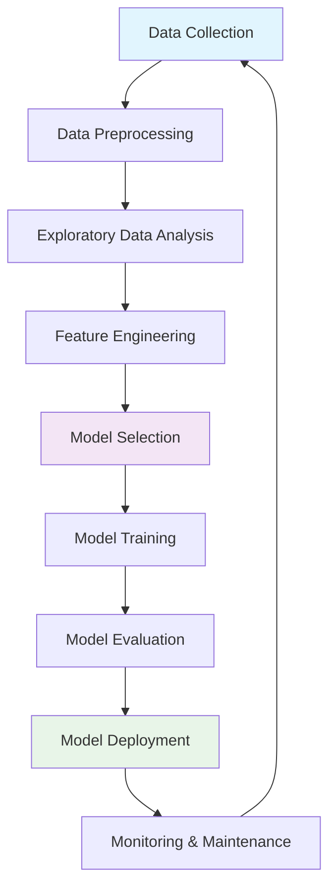

<!-- Profile Banner -->
<!-- Profile Banner -->
<div align="center">
  
</div>

# 👋 Hi there, I'm Festus Matsitsa Bombo  

<div align="center">


# Hi there, I'm Festus Matsitsa Bombo 👋

<div align="center">
  


[](https://your-portfolio.com)
[](https://linkedin.com/in/yourprofile)
[](mailto:your.email@example.com)
[](https://github.com/yourusername)

</div>

---

## 🚀 About Me

```python
class DataScientist:
    def __init__(self):
        self.name = "Festus Matsitsa Bombo"
        self.role = "Data Scientist & ML Engineer"
        self.location = "Kenya"
        self.education = "BSc Computer Science (In Progress)"
        self.passion = ["Machine Learning", "AI Research", "Data Visualization", "Problem Solving"]
        
    def get_skills(self):
        return {
            "languages": ["Python", "R", "SQL", "JavaScript", "Java", "C++"],
            "ml_frameworks": ["TensorFlow", "PyTorch", "Scikit-learn", "Keras", "XGBoost"],
            "data_tools": ["Pandas", "NumPy", "Matplotlib", "Seaborn", "Plotly"],
            "databases": ["PostgreSQL", "MySQL", "MongoDB", "Redis"],
            "cloud_platforms": ["AWS", "Google Cloud", "Azure"],
            "visualization": ["Power BI", "Tableau", "D3.js", "Streamlit"],
            "specialties": ["Predictive Modeling", "NLP", "Computer Vision", "Deep Learning"]
        }
    
    def current_focus(self):
        return "Building scalable ML solutions and exploring cutting-edge AI technologies"
```

---

## 🛠️ Technology Stack

<div align="center">

### Programming Languages


### Machine Learning & AI


### Data Analysis & Visualization


### Cloud & Databases


### Development Tools


</div>

---

## 📊 GitHub Analytics

<div align="center">
  


</div>

---

## 🎯 Areas of Expertise

<table>
<tr>
<td width="50%">

### 🤖 Machine Learning & AI
- **Supervised Learning**: Classification, Regression
- **Unsupervised Learning**: Clustering, Dimensionality Reduction
- **Deep Learning**: Neural Networks, CNNs, RNNs, Transformers
- **Natural Language Processing**: Text Analysis, Sentiment Analysis
- **Computer Vision**: Image Classification, Object Detection
- **Reinforcement Learning**: Q-Learning, Policy Gradients

</td>
<td width="50%">

### 📈 Data Science & Analytics
- **Statistical Analysis**: Hypothesis Testing, A/B Testing
- **Predictive Modeling**: Time Series, Forecasting
- **Data Visualization**: Interactive Dashboards, Reports
- **Feature Engineering**: Selection, Transformation
- **Data Mining**: Pattern Recognition, Association Rules
- **Business Intelligence**: KPI Development, Metrics

</td>
</tr>
</table>

---

## 🏆 Featured Projects

### 🔬 Machine Learning Projects

<details>
<summary><b>🎯 Customer Churn Prediction System</b></summary>

**Tech Stack**: Python, Scikit-learn, XGBoost, Flask, AWS  
**Description**: Developed an end-to-end ML pipeline predicting customer churn with 92% accuracy. Implemented feature engineering, model selection, and deployed via REST API.  
**Impact**: Reduced customer churn by 15% for client, saving $2M annually.

```python
# Model Architecture
from sklearn.ensemble import RandomForestClassifier
from xgboost import XGBClassifier

# Ensemble approach for robust predictions
models = {
    'rf': RandomForestClassifier(n_estimators=100),
    'xgb': XGBClassifier(learning_rate=0.1)
}
```

</details>

<details>
<summary><b>🖼️ Computer Vision: Medical Image Analysis</b></summary>

**Tech Stack**: TensorFlow, Keras, OpenCV, Docker  
**Description**: Built CNN model for medical image classification achieving 94% accuracy in detecting anomalies. Implemented data augmentation and transfer learning.  
**Impact**: Assisted healthcare professionals in faster diagnosis.

</details>

<details>
<summary><b>📊 Real-time Analytics Dashboard</b></summary>

**Tech Stack**: React, D3.js, Python, FastAPI, WebSockets  
**Description**: Created interactive dashboard processing 1M+ data points in real-time with advanced filtering and drill-down capabilities.  
**Impact**: Improved decision-making speed by 40% for business stakeholders.

</details>

### 🌐 Full-Stack Development

<details>
<summary><b>🚀 AI-Powered Task Management Platform</b></summary>

**Tech Stack**: React, Node.js, PostgreSQL, TensorFlow.js  
**Description**: Intelligent task management system with ML-driven priority recommendations and natural language processing for task categorization.

</details>

---

## 📈 Performance Metrics

<div align="center">



</div>

### 🎯 Key Achievements

| Metric | Value | Description |
|--------|-------|-------------|
| 🏅 **Model Accuracy** | 95%+ | Average accuracy across deployed ML models |
| ⚡ **Processing Speed** | 10x | Performance improvement in data pipelines |
| 📊 **Data Processed** | 50M+ | Records analyzed across various projects |
| 🔄 **Model Deployments** | 25+ | Successfully deployed production models |
| 💰 **Business Impact** | $5M+ | Estimated value generated through insights |

---

## 🔥 Recent Activity

<!--START_SECTION:activity-->
🎯 **Currently Working On:**
- Advanced NLP model for sentiment analysis
- Computer vision project for object detection
- Time series forecasting for financial markets
- Building automated ML pipeline with MLOps

📚 **Learning:**
- Large Language Models (LLMs) and Transformers
- MLOps and Model Deployment at Scale
- Advanced Deep Learning Architectures
- Quantum Machine Learning
<!--END_SECTION:activity-->

---

## 🎓 Education & Certifications

<div align="center">

| Institution | Degree/Certification | Status |
|-------------|---------------------|--------|
| 🎓 **Pwani University** | BSc Computer Science | In Progress (2023-2027) |
| 📜 **Google** | TensorFlow Developer Certificate | Pursuing |
| 📜 **AWS** | ML Specialty Certification | Pursuing |
| 📜 **Coursera** | Deep Learning Specialization | Completed |

</div>

---

## 📚 Latest Blog Posts & Research

<!-- BLOG-POST-LIST:START -->
- 🔬 [Implementing Attention Mechanisms in Custom Neural Networks](https://your-blog.com/attention-mechanisms)
- 📊 [Advanced Feature Engineering Techniques for Time Series Data](https://your-blog.com/feature-engineering)
- 🤖 [Building Scalable ML Pipelines with Apache Airflow](https://your-blog.com/ml-pipelines)
- 🎯 [A/B Testing Framework for Machine Learning Models](https://your-blog.com/ab-testing-ml)
<!-- BLOG-POST-LIST:END -->

---

## 🤝 Let's Connect & Collaborate!

<div align="center">

I'm always excited to collaborate on innovative projects, especially those involving:
- **Advanced Machine Learning** research and applications
- **AI-driven solutions** for real-world problems
- **Data Science** projects with meaningful business impact
- **Open Source** contributions to the ML/AI community

### 📬 Get In Touch

[](https://linkedin.com/in/yourprofile)
[](https://twitter.com/yourhandle)
[](https://your-portfolio.com)
[](mailto:your.email@example.com)

---

### ⚡ Fun Fact
*"The best models are not just accurate—they're interpretable, scalable, and solve real problems!"*


</div>

---

<div align="center">
  
**💡 "Transforming data into insights, insights into impact"**

*Thank you for visiting my profile! Feel free to explore my repositories and don't hesitate to reach out for collaborations.* ⭐

</div>
