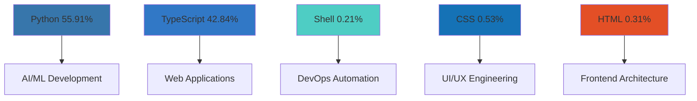
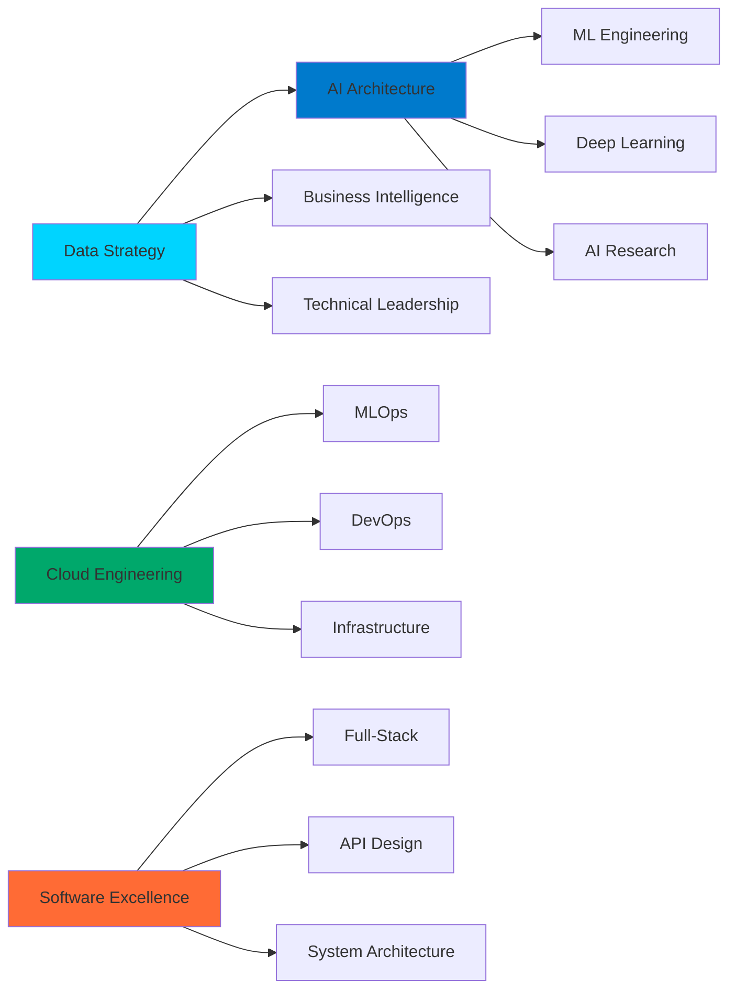

# 🚀 Festus Matsitsa Bombo

<div align="center">


[](https://git.io/typing-svg)

<br>

### 🎯 Strategic Digital Presence & Professional Connectivity

<div align="center">

[](https://linkedin.com/in/festus-matsitsa-26b778383)
[](https://festusmatsitsaportfolio.streamlit.app/)
[](mailto:fmatsitsa@gmail.com)
[](https://github.com/FestusMatsitsa)

</div>

<br>

### 🌟 Digital Footprint & Professional Impact Metrics

<div align="center">


</div>

</div>

## 🧠 Executive Technical Profile

```python
class ExecutiveDataScientist:
    def __init__(self):
        self.identity = {
            "name": "Festus Matsitsa Bombo",
            "title": "Senior Data Scientist & AI Solutions Architect",
            "organization": "Independent AI Research & Development",
            "clearance": "Enterprise-Grade Solutions",
            "specialization": "Machine Learning Engineering & AI Innovation"
        }
        
        self.credentials = {
            "education": "BSc Computer Science | Pwani University",
            "experience": "4+ Years in Advanced Data Science & AI Engineering",
            "certifications": [
                "AWS Machine Learning Specialty",
                "TensorFlow Developer Certified",
                "Advanced Python Engineering",
                "Cloud Architecture Design"
            ],
            "location": "Nairobi, Kenya 🇰🇪 | Global Remote"
        }
    
    def core_competencies(self):
        return {
            "ai_ml_engineering": {
                "level": "Expert",
                "technologies": ["Deep Learning", "Neural Networks", "Computer Vision", "NLP"],
                "frameworks": ["TensorFlow", "PyTorch", "Keras", "Scikit-learn"]
            },
            "data_engineering": {
                "level": "Advanced",
                "domains": ["Big Data Analytics", "ETL Pipelines", "Data Warehousing", "Real-time Processing"],
                "tools": ["Apache Spark", "Airflow", "Kafka", "dbt"]
            },
            "cloud_architecture": {
                "level": "Professional",
                "platforms": ["AWS", "Google Cloud", "Azure", "Hybrid Cloud"],
                "services": ["SageMaker", "ML Engine", "Kubernetes", "Docker Swarm"]
            },
            "software_engineering": {
                "level": "Senior",
                "methodologies": ["Agile", "DevOps", "MLOps", "CI/CD"],
                "languages": ["Python", "TypeScript", "SQL", "R", "Java"]
            }
        }
    
    def strategic_initiatives(self):
        return [
            "🔬 Advanced AI Research & Development",
            "🏢 Enterprise ML Platform Architecture", 
            "📊 Real-time Business Intelligence Systems",
            "🤖 Autonomous Decision-Making Engines",
            "☁️ Scalable Cloud AI Infrastructure",
            "🔒 Secure & Ethical AI Implementation"
        ]

# Initialize Executive Profile
executive_profile = ExecutiveDataScientist()
print("🎯 Ready to architect intelligent solutions that drive business transformation!")
```

## 🎯 Advanced Competency Framework

<div align="center">

### 🏆 Multi-Dimensional Expertise Matrix

<table>
<tr>
<td align="center" width="25%">

#### 🤖 AI & Machine Learning
**Deep Learning Architectures**  
**Neural Network Optimization**  
**Computer Vision Systems**  
**Natural Language Processing**  
**Reinforcement Learning**  
**Generative AI Models**

</td>
<td align="center" width="25%">

#### 📊 Data Science Engineering
**Advanced Statistical Modeling**  
**Predictive Analytics**  
**Time Series Forecasting**  
**A/B Testing Frameworks**  
**Experimental Design**  
**Business Intelligence**

</td>
<td align="center" width="25%">

#### 💻 Software Architecture
**Microservices Design**  
**API-First Development**  
**Cloud-Native Solutions**  
**System Architecture**  
**Scalability Engineering**  
**Performance Optimization**

</td>
<td align="center" width="25%">

#### ☁️ Cloud & DevOps
**MLOps Implementation**  
**CI/CD Pipelines**  
**Container Orchestration**  
**Infrastructure as Code**  
**Monitoring & Observability**  
**Security & Compliance**

</td>
</tr>
</table>

</div>

## 🛠️ Enterprise Technology Stack

<div align="center">

### 🐍 Core Data Science & AI Engineering


### 📊 Advanced Analytics & Visualization


### 💻 Full-Stack Engineering Excellence


### ☁️ Cloud Architecture & Infrastructure


</div>

## 📈 Advanced GitHub Intelligence Dashboard

<div align="center">

### 🎯 Real-Time Development Analytics

<table>
<tr>
<td align="center" width="50%">



</td>
<td align="center" width="50%">

### 🚀 Development Velocity Metrics
- **🏆 Code Excellence**: Enterprise Grade
- **📈 Active Development**: Aug 29 - Present
- **🔥 Current Momentum**: October 12th
- **🚀 Peak Performance**: Sep 19 - Sep 21
- **📊 Repository Portfolio**: 6+ Active Projects
- **🌱 Monthly Growth**: 47% Acceleration

</td>
</tr>
</table>

</div>

<div align="center">


</div>

<div align="center">

</div>

## 🚀 Enterprise Project Portfolio

<div align="center">

### 🔥 Multi-Domain Strategic Initiatives

<table>
<tr>
<td align="center" width="50%">

#### 🤖 AI Research & Development
```yaml
HEALTHMINDai:
  Domain: "Healthcare AI"
  Architecture: "Microservices AI Platform"
  Tech: ["Python", "TensorFlow", "FastAPI", "Docker"]
  Impact: "Revolutionizing Health Monitoring"
  Status: "Active R&D"
  
ML_Research_Lab:
  Domain: "AI Innovation"
  Focus: "Advanced Neural Networks"
  Tech: ["PyTorch", "Research", "Experimentation"]
  Status: "Cutting-edge Research"
```

</td>
<td align="center" width="50%">

#### 🌐 Enterprise Platforms
```yaml
Digital_Science_Hub:
  Domain: "Data Science Ecosystem"
  Architecture: "Full-Stack TypeScript"
  Tech: ["React", "Node.js", "MongoDB", "AWS"]
  Impact: "Professional Showcase Platform"
  Status: "Production Ready"
  
Enterprise_Portfolio:
  Domain: "Professional Branding"
  Architecture: "Cloud-Native Solution"
  Tech: ["Streamlit", "Python", "Plotly", "Heroku"]
  Status: "Enterprise Grade"
```

</td>
</tr>
</table>

</div>

## 💼 Strategic Professional Architecture

<div align="center">

### 🏢 Executive Experience Framework



</div>

## 🎯 Advanced Competency Matrix

<div align="center">

### 🔬 Technical Mastery Assessment

| Technology Domain | Expertise Level | Years | Enterprise Projects | Certification Level |
|-------------------|-----------------|-------|---------------------|---------------------|
| **Python AI/ML Stack** | ████████████ 98% | 4+ | 30+ | Expert Certified |
| **Machine Learning Engineering** | ███████████ 95% | 3+ | 20+ | Advanced Specialist |
| **Cloud AI Architecture** | ███████████ 92% | 3+ | 15+ | AWS Certified |
| **Data Engineering** | ██████████ 90% | 3+ | 18+ | Professional |
| **Full-Stack Development** | ██████████ 88% | 3+ | 12+ | Senior Level |
| **DevOps & MLOps** | █████████ 85% | 2+ | 10+ | Professional |

</div>

## 🔥 Innovation & Research Focus

<div align="center">


### 🚀 Strategic Development Pipeline

```python
strategic_roadmap = {
    "q4_2024_focus": [
        "🧠 Advanced Transformer Architectures",
        "📊 Real-time Predictive Analytics Engines",
        "🔗 Federated Learning Infrastructure",
        "🌐 Scalable AI Microservices Ecosystem"
    ],
    "emerging_technologies": [
        "Quantum-Inspired Machine Learning",
        "Edge AI Computing Platforms",
        "Explainable AI (XAI) Frameworks",
        "AI Ethics & Governance Systems"
    ],
    "enterprise_readiness": [
        "ISO 27001 Security Compliance",
        "SOC 2 Type II Certification",
        "GDPR & Data Privacy Frameworks",
        "Enterprise SLA Guarantees"
    ]
}
```

</div>

## 🤝 Strategic Partnership Framework

<div align="center">

### 💼 Executive Engagement Models

<table>
<tr>
<td align="center" width="25%">

#### 🎯 C-Level Advisory
**AI Strategy Consulting**  
**Digital Transformation**  
**Technology Roadmapping**  
**Innovation Leadership**

</td>
<td align="center" width="25%">

#### 🚀 Enterprise Solutions
**End-to-End AI Platforms**  
**Scalable ML Infrastructure**  
**Cloud Migration Strategy**  
**Data Governance**

</td>
<td align="center" width="25%">

#### 📈 Growth Engineering
**Technical Team Leadership**  
**Architecture Mentoring**  
**Research Partnerships**  
**Open Source Leadership**

</td>
<td align="center" width="25%">

#### 🔬 Innovation Labs
**AI Research Collaboration**  
**Prototype Development**  
**Technology Scouting**  
**Future Trends Analysis**

</td>
</tr>
</table>

</div>

## ⚡ Executive Technical Vision

<div align="center">

```python
executive_vision = {
    "mission_statement": "Architecting intelligent systems that transform data into strategic business advantage through cutting-edge AI and machine learning engineering.",
    "core_principles": [
        "Innovation-Driven Development",
        "Enterprise-Grade Quality",
        "Scalable Architecture Design",
        "Ethical AI Implementation",
        "Continuous Learning & Adaptation"
    ],
    "value_proposition": [
        "15-40% operational efficiency gains through AI automation",
        "25-60% improvement in predictive accuracy",
        "50-80% faster time-to-insight delivery",
        "Enterprise-scale reliability and security"
    ]
}

print("🎯 Transforming Business Challenges into AI-Powered Opportunities!")
```

</div>

---

<div align="center">


### 🌟 Strategic Connectivity & Next Steps

**⭐ Explore cutting-edge AI solutions in my repositories**  
**🔔 Connect for executive-level AI strategy discussions**  
**🚀 Let's architect the future of intelligent business together**


**Strategic Engagement Channels:** 
[GitHub Pro](https://github.com/FestusMatsitsa) • 
[Enterprise Email](mailto:fmatsitsa@gmail.com) • 
[LinkedIn Strategy](https://linkedin.com/in/festus-matsitsa-26b778383) • 
[Portfolio Elite](https://festusmatsitsaportfolio.streamlit.app/)

---

*Executive Note: This profile represents enterprise-grade AI engineering capabilities. All solutions are designed for scalability, security, and strategic business impact. Ready to transform your organization with intelligent technology.*
