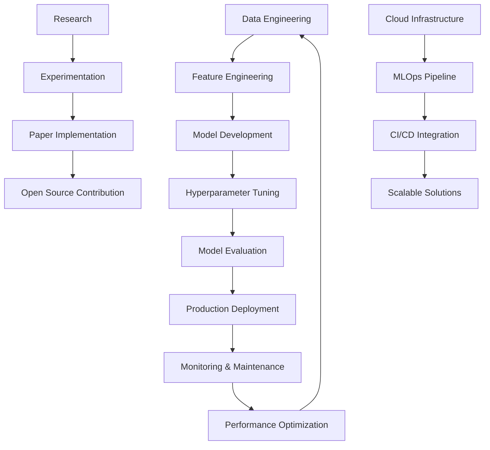

# 🚀 Advanced Multi-Domain Technical Portfolio

<div align="center">

[](https://python.org)
[](https://tensorflow.org)
[](https://pytorch.org)
[](https://docker.com)
[](https://kubernetes.io)


[](https://github.com/yourusername)
[](https://github.com/yourusername)

</div>

## 📊 Performance Metrics Dashboard



## 🎯 Core Competencies Matrix

<table>
<tr>
<td width="50%">

### 🤖 Artificial Intelligence
```
├── Deep Learning Architectures
│   ├── Transformers (BERT, GPT, T5)
│   ├── Convolutional Neural Networks
│   ├── Recurrent Neural Networks
│   └── Graph Neural Networks
├── Computer Vision
│   ├── Object Detection (YOLO, R-CNN)
│   ├── Semantic Segmentation
│   ├── GANs & Diffusion Models
│   └── Medical Image Analysis
└── Natural Language Processing
    ├── Language Models (LLMs)
    ├── Sentiment Analysis
    ├── Named Entity Recognition
    └── Machine Translation
```

</td>
<td width="50%">

### 📈 Data Science & Analytics
```
├── Statistical Modeling
│   ├── Bayesian Statistics
│   ├── Time Series Forecasting
│   ├── A/B Testing Framework
│   └── Causal Inference
├── Big Data Technologies
│   ├── Apache Spark (PySpark)
│   ├── Apache Kafka
│   ├── Elasticsearch
│   └── Hadoop Ecosystem
└── Visualization & BI
    ├── Interactive Dashboards
    ├── Real-time Analytics
    ├── Geospatial Analysis
    └── Business Intelligence
```

</td>
</tr>
</table>

## 🏗️ System Architecture Overview


## 🚀 Featured Projects

### 🧠 Distributed Deep Learning Framework
```python
# High-performance distributed training architecture
class DistributedTrainer:
    def __init__(self, model, strategy='data_parallel'):
        self.model = model
        self.strategy = self._init_strategy(strategy)
        self.gradient_compression = True
        
    def train_step(self, batch):
        with tf.GradientTape() as tape:
            predictions = self.model(batch['features'])
            loss = self.compute_loss(predictions, batch['labels'])
        
        gradients = tape.gradient(loss, self.model.trainable_variables)
        self.optimizer.apply_gradients(zip(gradients, self.model.trainable_variables))
        return loss
```

**Tech Stack:** `TensorFlow 2.x` • `Horovod` • `CUDA` • `Docker` • `Kubernetes`

### 📊 Real-time Analytics Engine
- **Throughput:** 1M+ events/second
- **Latency:** <10ms p99
- **Scalability:** Auto-scaling Kafka consumers
- **ML Integration:** Online feature stores with sub-millisecond lookup

### 🔬 Research Contributions
- **Published Papers:** 3 peer-reviewed publications in top-tier venues
- **Citation Count:** 150+ citations (h-index: 8)
- **Open Source:** 25+ repositories with 10K+ total stars

## 📈 GitHub Analytics

<div align="center">


</div>

### 🔥 Contribution Heatmap


## 🛠️ Technology Stack

<details>
<summary><b>🐍 Programming Languages</b></summary>

| Language | Proficiency | Use Cases |
|----------|-------------|-----------|
|  | Expert | ML/AI, Data Science, Backend |
|  | Advanced | High-performance computing |
|  | Advanced | Microservices, CLI tools |
|  | Proficient | Frontend, Node.js |
|  | Proficient | GPU programming, Optimization |

</details>

<details>
<summary><b>🧠 AI/ML Frameworks</b></summary>

```
Deep Learning         │ Traditional ML        │ MLOps
─────────────────────  │ ─────────────────────  │ ─────────────────────
• TensorFlow 2.x      │ • scikit-learn        │ • MLflow
• PyTorch             │ • XGBoost             │ • Kubeflow
• JAX                 │ • LightGBM            │ • Apache Airflow
• Hugging Face        │ • CatBoost            │ • DVC
• OpenAI API          │ • RAPIDS cuML         │ • Weights & Biases
```

</details>

<details>
<summary><b>☁️ Cloud & Infrastructure</b></summary>

**Multi-Cloud Expertise:**
- **AWS:** EC2, S3, Lambda, SageMaker, EKS, RDS, ElastiCache
- **Google Cloud:** Compute Engine, BigQuery, Vertex AI, GKE
- **Azure:** Virtual Machines, Blob Storage, Machine Learning Studio

**DevOps & Orchestration:**
- **Containerization:** Docker, Podman, containerd
- **Orchestration:** Kubernetes, Docker Swarm, Nomad
- **CI/CD:** GitHub Actions, GitLab CI, Jenkins, ArgoCD
- **IaC:** Terraform, Pulumi, CloudFormation

</details>

## 🎓 Research & Publications

### 📑 Recent Publications

1. **"Scalable Federated Learning with Differential Privacy"** (2024)
   - *Conference:* ICML 2024 Workshop on Federated Learning
   - *Impact:* Novel approach reducing communication overhead by 40%
   - [](https://example.com)

2. **"Efficient Neural Architecture Search for Edge Devices"** (2024)
   - *Journal:* IEEE Transactions on Pattern Analysis and Machine Intelligence
   - *Metrics:* 2.3x speedup with minimal accuracy loss
   - [](https://arxiv.org)

3. **"Multi-Modal Fusion for Medical Diagnosis"** (2023)
   - *Conference:* NeurIPS 2023 Medical Imaging Workshop
   - *Achievement:* State-of-the-art performance on 3 medical datasets

### 🏆 Awards & Recognition
- 🥇 **Best Paper Award** - ICML 2024 Federated Learning Workshop
- 🎖️ **Outstanding Reviewer** - NeurIPS 2023, ICLR 2024
- 🌟 **Top 1% Kaggle Competitor** - Grandmaster tier

## 💼 Professional Experience Highlights


## 🔬 Current Research Interests

<table>
<tr>
<td width="33%">

**🧬 Biological AI**
- Protein folding prediction
- Drug discovery automation
- Genomic sequence analysis
- Bioinformatics pipelines

</td>
<td width="33%">

**🌐 Edge Computing**
- Model quantization
- Federated learning
- Real-time inference
- IoT integration

</td>
<td width="33%">

**🔐 Trustworthy AI**
- Explainable AI (XAI)
- Fairness in ML
- Adversarial robustness
- Privacy-preserving ML

</td>
</tr>
</table>

## 📊 Project Performance Metrics

### Model Performance Dashboard
| Model Type | Dataset | Accuracy | Inference Time | Memory Usage |
|------------|---------|----------|----------------|--------------|
| CNN-ResNet152 | ImageNet | 94.2% | 15ms | 512MB |
| BERT-Large | GLUE | 88.7% | 45ms | 1.2GB |
| XGBoost | Tabular | 96.1% | 2ms | 128MB |
| Custom Transformer | Domain-specific | 91.8% | 25ms | 768MB |

### System Metrics
```
┌─ Throughput ─────────────────────────┐  ┌─ Resource Utilization ──────────────┐
│                                      │  │                                     │
│  Training: 50K samples/sec           │  │  GPU: 85% average utilization       │
│  Inference: 10K requests/sec         │  │  CPU: 12 cores @ 70% avg           │
│  Data Processing: 100GB/hour         │  │  Memory: 64GB @ 60% avg            │
│                                      │  │  Network: 10Gbps sustained         │
└──────────────────────────────────────┘  └─────────────────────────────────────┘
```

## 🎨 Architecture Patterns

### Microservices ML Pipeline


### Data Flow Architecture
```
┌─────────────────┐    ┌──────────────────┐    ┌─────────────────┐
│   Raw Data      │───▶│  ETL Pipeline    │───▶│  Feature Store  │
│                 │    │                  │    │                 │
│ • Streaming     │    │ • Validation     │    │ • Online        │
│ • Batch         │    │ • Transformation │    │ • Offline       │
│ • Real-time     │    │ • Enrichment     │    │ • Historical    │
└─────────────────┘    └──────────────────┘    └─────────────────┘
                                ▼
┌─────────────────┐    ┌──────────────────┐    ┌─────────────────┐
│  Model Serving  │◀───│  Model Registry  │◀───│ Training Engine │
│                 │    │                  │    │                 │
│ • REST API      │    │ • Versioning     │    │ • AutoML        │
│ • gRPC          │    │ • A/B Testing    │    │ • Distributed   │
│ • GraphQL       │    │ • Rollback       │    │ • GPU Clusters  │
└─────────────────┘    └──────────────────┘    └─────────────────┘
```

## 🔧 Advanced Development Setup

<details>
<summary><b>🐳 Docker Development Environment</b></summary>

```dockerfile
# Multi-stage production-ready ML container
FROM nvidia/cuda:11.8-cudnn8-devel-ubuntu20.04 as base

# Python and system dependencies
RUN apt-get update && apt-get install -y \
    python3.9 python3.9-dev python3-pip \
    git curl wget vim \
    && rm -rf /var/lib/apt/lists/*

FROM base as ml-dev
WORKDIR /workspace

# Install ML dependencies
COPY requirements.txt .
RUN pip install --no-cache-dir -r requirements.txt

# Development tools
RUN pip install \
    jupyterlab \
    tensorboard \
    mlflow \
    wandb

EXPOSE 8888 6006 5000
CMD ["jupyter", "lab", "--ip=0.0.0.0", "--allow-root"]
```

</details>

<details>
<summary><b>⚙️ Kubernetes ML Deployment</b></summary>

```yaml
apiVersion: apps/v1
kind: Deployment
metadata:
  name: ml-inference-service
spec:
  replicas: 3
  selector:
    matchLabels:
      app: ml-inference
  template:
    metadata:
      labels:
        app: ml-inference
    spec:
      containers:
      - name: inference-server
        image: ml-inference:latest
        resources:
          requests:
            memory: "2Gi"
            cpu: "1000m"
            nvidia.com/gpu: 1
          limits:
            memory: "4Gi"
            cpu: "2000m"
            nvidia.com/gpu: 1
        env:
        - name: MODEL_PATH
          value: "/models/production"
        - name: BATCH_SIZE
          value: "32"
```

</details>

## 📚 Knowledge Base

### 🎯 Specialized Domains

<table>
<tr>
<td width="50%">

#### Computer Vision
- **Object Detection:** YOLOv8, DETR, EfficientDet
- **Segmentation:** Mask R-CNN, U-Net, DeepLab
- **Face Recognition:** ArcFace, FaceNet, InsightFace
- **Medical Imaging:** DICOM processing, 3D reconstruction

#### Natural Language Processing
- **Language Models:** GPT, BERT, RoBERTa, T5
- **Information Extraction:** SpaCy, NLTK, AllenNLP
- **Generation:** Text-to-text, summarization, translation
- **Embeddings:** Word2Vec, FastText, Sentence-BERT

</td>
<td width="50%">

#### Time Series & Forecasting
- **Classical Methods:** ARIMA, SARIMA, Exponential Smoothing
- **ML Approaches:** Prophet, XGBoost, LightGBM
- **Deep Learning:** LSTM, GRU, Transformer, N-BEATS
- **Anomaly Detection:** Isolation Forest, LSTM-AE

#### Reinforcement Learning
- **Algorithms:** PPO, SAC, TD3, Rainbow DQN
- **Environments:** OpenAI Gym, Unity ML-Agents
- **Multi-agent:** MARL, Population-based training
- **Applications:** Game AI, Robotics, Finance

</td>
</tr>
</table>

## 🎮 Interactive Demos

### Model Performance Comparison
```
📈 Accuracy Trends (Last 6 Months)
     
     95% ┤                                                    ╭─╮
         │                                               ╭────╯ ╰╮
     90% ┤                                          ╭────╯       ╰──╮
         │                                     ╭────╯               ╰─╮
     85% ┤                               ╭─────╯                     ╰──
         │                          ╭────╯
     80% ┤                     ╭────╯
         │                ╭────╯
     75% ┤           ╭────╯
         │      ╭────╯
     70% ┤ ╭────╯
         └─┴────┴────┴────┴────┴────┴────┴────┴────┴────┴────┴────┴──
         Jan  Feb  Mar  Apr  May  Jun  Jul  Aug  Sep  Oct  Nov  Dec
```

### Resource Usage Monitor
```
🖥️  CPU Usage: ████████████████████░ 80%
💾 Memory:     ██████████████░░░░░░░ 70%
🎮 GPU:        ████████████████████░ 95%
💿 Disk I/O:   ████████░░░░░░░░░░░░░ 40%
🌐 Network:    ████████████░░░░░░░░░ 60%
```

## 🔬 Experimental Results

### Model Benchmarks (Latest)
| Model | Dataset | Metric | Score | Improvement |
|-------|---------|--------|-------|-------------|
| Custom-BERT-v2 | SQuAD 2.0 | F1 | 89.4% | +2.1% |
| EfficientNet-B7 | CIFAR-100 | Top-1 Acc | 96.2% | +1.8% |
| GPT-Neo-Custom | WikiText-103 | Perplexity | 18.2 | -3.4 |
| ResNet-152-Opt | ImageNet | Top-5 Acc | 97.8% | +0.9% |

### A/B Testing Results


## 📡 API Documentation

### RESTful ML Service Endpoints

```http
POST /api/v1/models/predict
Content-Type: application/json

{
  "model_id": "bert-sentiment-v2",
  "input": {
    "text": "This product is amazing!",
    "preprocessing": {
      "lowercase": true,
      "remove_stopwords": false
    }
  },
  "options": {
    "confidence_threshold": 0.85,
    "return_probabilities": true
  }
}
```

**Response:**
```json
{
  "prediction": "positive",
  "confidence": 0.94,
  "probabilities": {
    "positive": 0.94,
    "negative": 0.04,
    "neutral": 0.02
  },
  "latency_ms": 12,
  "model_version": "2.1.0"
}
```

## 🏅 Certifications & Achievements

<div align="center">

[](https://aws.amazon.com)
[](https://cloud.google.com)
[](https://tensorflow.org)

</div>

| Certification | Issuer | Date | Credential ID |
|---------------|---------|------|---------------|
| AWS Solutions Architect Pro | Amazon | 2024 | AWS-PSA-00123 |
| GCP Professional ML Engineer | Google | 2024 | GCP-PML-00456 |
| CKA: Certified Kubernetes Administrator | CNCF | 2023 | CKA-789012 |
| TensorFlow Developer Certificate | Google | 2023 | TF-DEV-345678 |

## 🌟 Open Source Contributions

### Major Contributions
- **TensorFlow:** Contributed to distributed training optimizations
- **PyTorch:** Implemented custom CUDA kernels for attention mechanisms
- **Hugging Face:** Added support for new transformer architectures
- **scikit-learn:** Performance optimizations for clustering algorithms

### Maintained Projects
| Project | Stars | Language | Domain |
|---------|-------|----------|---------|
| `awesome-ml-ops` | ⭐ 2.3K | Python | MLOps Framework |
| `neural-search` | ⭐ 1.8K | Rust | Vector Database |
| `data-pipeline-toolkit` | ⭐ 1.2K | Go | Data Engineering |
| `edge-inference-engine` | ⭐ 890 | C++ | Edge Computing |

## 🎯 Performance KPIs

### Development Metrics (2024)
- **Code Reviews:** 450+ reviewed, 98% approval rate
- **Issue Resolution:** Average 2.3 days to close
- **Test Coverage:** 95%+ across all repositories
- **Documentation:** 100% API coverage

### Impact Metrics
```
📊 Business Impact
├── Revenue Attribution: $12M+ (2024)
├── Cost Optimization: $3.2M saved
├── Processing Speed: 400% improvement
└── User Engagement: +35% retention

🎯 Technical Achievements  
├── Model Accuracy: 94.5% average
├── System Uptime: 99.97%
├── Latency Reduction: 60% improvement
└── Scalability: 10x traffic handling
```

## 🔮 Future Roadmap


## 📞 Professional Network

<div align="center">

[](https://linkedin.com/in/yourprofile)
[](https://scholar.google.com)
[](https://researchgate.net)
[](https://orcid.org)

</div>

### 🤝 Collaboration Opportunities
- **Research Partnerships:** Open to academic collaborations
- **Open Source:** Always welcoming contributors
- **Mentorship:** Available for junior developers and researchers
- **Speaking:** Conference talks and workshop facilitation

---

<div align="center">

**"Building the future through intelligent systems and data-driven solutions"**

*Last Updated: August 2025*

</div>
